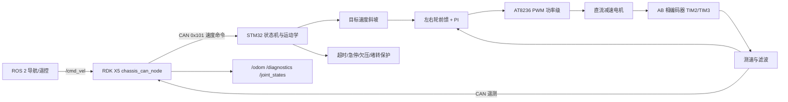

# 系统设计与代码原理

## 1. 系统最终实现什么

系统允许 ROS 2 导航、键盘或你自己的上位机节点发布 `/cmd_vel`。RDK X5 以 50 Hz 将线速度和角速度发送到 CAN；STM32 以 100 Hz 独立闭环控制两个驱动轮。即使 ROS 节点崩溃、CAN 线断开或上位机卡死，STM32 在 200 ms 后也会主动撤销 PWM。

STM32 返回下列数据：

- 左右轮目标速度和滤波后的实际速度；
- 左右电机 PWM 和当前速度误差；
- 左右编码器累计值与最近增量；
- 电池电压、工作状态、故障位和控制超时次数；
- 固件版本、运行时间和心跳。

ROS 2 将这些数据转换为 `/odom`、`/joint_states`、`/diagnostics` 和 `/motor/debug`，必要时广播 `odom -> base_link` TF。

## 1.1 两份资料怎样结合

小车资料决定真实硬件路径：STM32F407 的 TIM2/TIM3 读取 GMR 编码器，定时任务计算速度，最后通过 `Set_Pwm` 控制 AT8236。GD 工程没有对应实物，因此没有照搬它的芯片寄存器代码；本项目吸收的是它更完整的软件组织思路：上位机 CAN 命令、通信看门狗、明确状态、故障集中处理、周期反馈，以及只有一个任务拥有最终电机输出权。

所以最终结果仍然能在手头 C30D 硬件上运行，同时不止停留在原小车代码的“接收速度—算 PI—写 PWM”路径，而是形成从 ROS 2 到实时控制、保护、观测和调参的完整系统。

## 2. 分层职责



这种划分把实时环放在 STM32。RDK X5 的 Linux/ROS 2 偶尔出现调度抖动，不会直接破坏 100 Hz 电机控制周期。

## 3. 电机是怎样被控制的

### 3.1 编码器测速

C30D 原工程把 TIM2 和 TIM3 配成编码器模式。每 10 ms 读取一次计数器并清零。若一圈输出轴对应 `N` 个计数、轮径为 `D`，本周期计数为 `delta`，控制周期为 `dt`，则：

```text
轮周长 = pi * D
车轮位移 = delta * 轮周长 / N
实际速度 = 车轮位移 / dt
```

500 线电机、定时器四倍频和 30:1 减速比的理论值为 `500 * 4 * 30 = 60000 count/rev`。R550 Mini 资料同时给出 65 mm 轮径、162 mm 轮距和 144 mm 轴距，本项目以这些值作为默认值。但“500 线”可能被厂家用来指不同口径，轮胎也会变形，仍必须用实车验证。

### 3.2 目标速度斜坡

上位机从 0 突然给 0.6 m/s 时，程序不会直接把内部目标跳到 0.6，而是按照 `acceleration_mps2 * dt` 逐周期靠近。停车使用独立的 `deceleration_mps2`。这样可降低机械冲击、电流峰值和轮胎打滑。

### 3.3 前馈 + PI

每个轮子独立计算：

```text
误差 e = 斜坡目标速度 - 滤波实际速度
前馈 = Kff * 目标速度 + 带方向的死区补偿
比例 = Kp * e
积分 = 积分 + Ki * e * dt
PWM = 限幅(前馈 + 比例 + 积分)
```

前馈承担大部分“跑到这个速度大概需要多少 PWM”；比例项处理瞬时误差；积分项消除稳定负载下的残余误差。输出饱和时采用条件积分：若误差还想把 PWM 推得更高，就暂停积分；若误差有助于退出饱和，则保留积分。目标回到零或安全状态禁止输出时，积分会立即清零。

这比只写一个 `PWM = 速度` 更有项目价值，因为它涉及传感反馈、离散控制、非线性死区、饱和与安全状态的完整闭环。

### 3.4 直行同步

左右轮分别闭环后仍可能因为轮径、地面摩擦和负载不同而缓慢跑偏。当角速度命令接近零时，程序记录左右轮起始距离，并计算：

```text
同步误差 = 左轮相对位移 - 右轮相对位移
修正量 = 限幅(Ksync * 同步误差)
左目标 -= 修正量
右目标 += 修正量
```

该环只在明确直行时启用，转弯时关闭，避免与运动学目标相互对抗。

### 3.5 车体运动学

差速和两后轮驱动的阿克曼底盘都可用以下关系得到左右驱动轮速度：

```text
left  = linear - angular * track / 2
right = linear + angular * track / 2
```

阿克曼模式另外计算转向角：

```text
steering = atan(wheelbase * angular / linear)
servo_pwm = servo_center + servo_pwm_per_rad * steering
```

阿克曼车不能原地旋转，因此线速度绝对值小于 0.02 m/s 时程序把线速度和角速度同时置零。舵机范围在参数中做双重限幅。

## 4. 安全状态机

| 状态 | 条件 | PWM |
|---|---|---|
| `BOOT` | 初始化短暂阶段 | 0 |
| `IDLE` | 未收到命令、软件未使能或硬件使能开关关闭 | 0 |
| `RUNNING` | CAN 命令新鲜、软件和硬件均使能、无严重故障 | 闭环输出 |
| `TIMEOUT` | 超过参数规定时间没收到合法命令 | 0 |
| `FAULT` | 欠压、编码器异常、堵转或参数错误 | 0 |
| `ESTOP` | 收到急停位 | 0 |

急停、欠压、编码器异常和堵转会锁存，必须先下发“禁止运行且非急停”的命令，再发送带钥匙的清故障系统命令。普通通信超时是动态故障，新鲜命令到来后可自动恢复。

## 5. 故障判据

- 命令超时：合法速度命令间隔大于 `command_timeout_ms`。
- 欠压：采样电压非零且低于 `low_battery_mv`。
- 编码器异常：计算速度连续 3 个周期超过 `physical_speed_limit_mps`。
- 堵转：目标速度足够大、实际速度接近零且 PWM 超过比例阈值，持续时间超过 `stall_time_ms`。
- 控制周期异常：实际周期小于 5 ms 或大于 20 ms，使用 10 ms 代替异常 dt 并记录计数。
- 参数错误：Flash 中参数的魔数、版本、长度、范围或 CRC32 不正确。

## 6. 并发与数据所有权

- `chassis_control_task` 是唯一读取编码器和写电机 PWM 的任务。
- `chassis_can_task` 是唯一操作本项目 CAN 收发的任务。
- 两个任务用一个 FreeRTOS mutex 保护 `g_chassis_app`。
- 无动态内存、无递归，控制路径没有阻塞式日志输出。
- CAN 任务发送失败时允许丢掉旧遥测，因为下一周期会发送最新状态；控制不依赖遥测成功。
