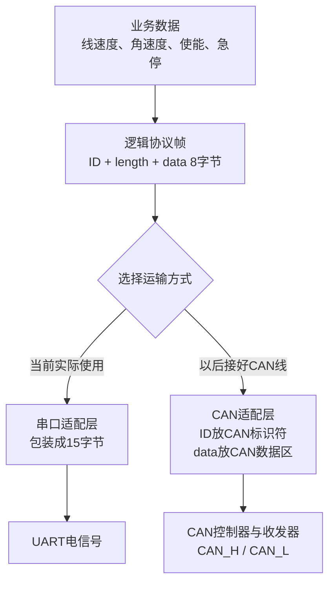
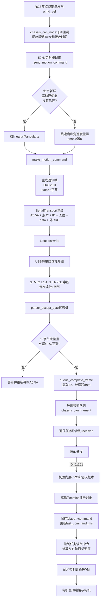
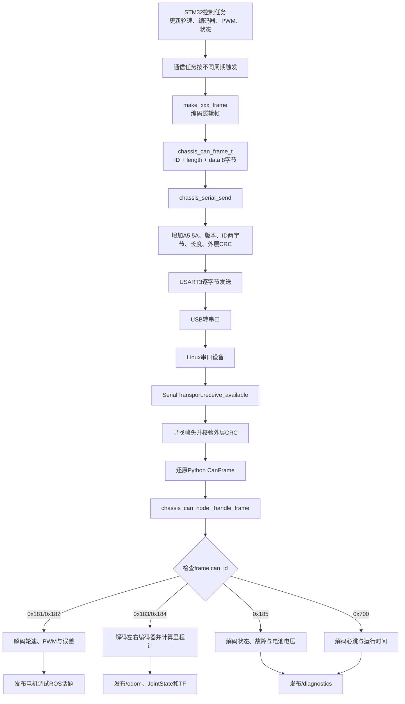
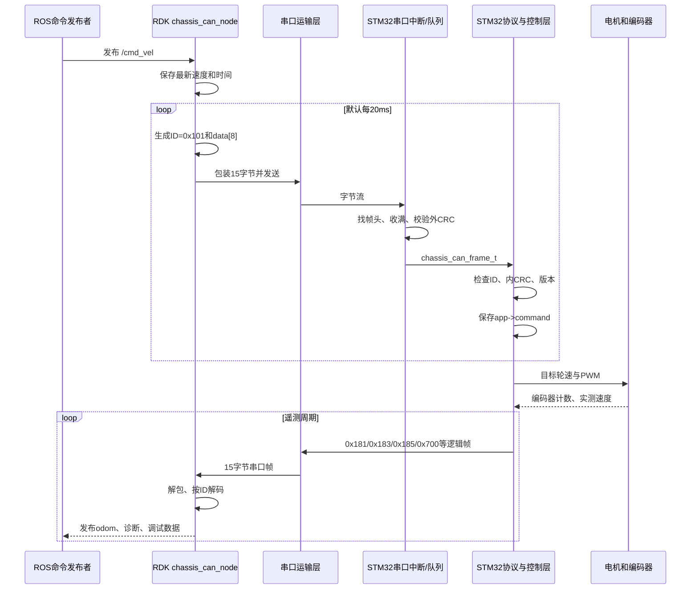
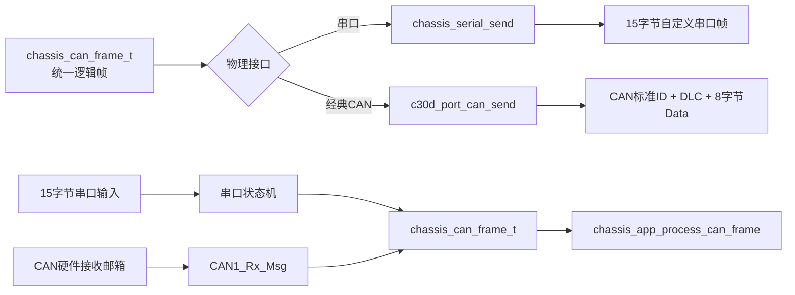

# 小端序、`0x101`、CAN 帧与上下位机数据流详解

> 适用工程：RDK X5 + STM32F407 C30D 底盘控制工程  
> 当前实际通信：串口（UART）  
> 同时说明：以后切换到经典 CAN 时，同一套“逻辑协议”如何使用

---

## 1. 先直接回答三个问题

### 1.1 小端序一定需要两个字节吗？

不是。

“小端序”只规定：**一个多字节数字拆成多个字节时，低位字节先放，高位字节后放。**

它并不规定一个数据必须占两个字节。数据占几个字节，由这个数据的类型或协议字段宽度决定。

| 数据类型或字段 | 字节数 | 是否涉及大小端 |
|---|---:|---|
| `uint8_t` | 1 | 不涉及，只有一个字节 |
| `uint16_t` / `int16_t` | 2 | 涉及 |
| `uint32_t` / `int32_t` | 4 | 涉及 |
| `float`（本工程 MCU 中） | 4 | 涉及 |

本工程把逻辑 ID 作为普通整数装入串口帧时，为它固定预留了两个字节。`0x101` 大于 `0xFF`，至少需要 9 个二进制位，因此一个字节放不下，必须使用两个字节：

```text
0x0101
高字节 = 0x01
低字节 = 0x01

按小端序发送：01 01
```

再看几个更容易辨认的例子：

| ID | 两字节十六进制形式 | 串口中按小端序发送 |
|---:|---:|---:|
| `0x101` | `0x0101` | `01 01` |
| `0x181` | `0x0181` | `81 01` |
| `0x185` | `0x0185` | `85 01` |
| `0x700` | `0x0700` | `00 07` |

所以，看到 `01 01` 时不要把它理解成两个不同的数据；它们合起来表示一个 ID：`0x101`。

### 1.2 当前串口发送的两个字节是 ID 吗？

是。当前 15 字节串口帧的第 3、4 下标位置保存逻辑消息 ID：

```text
下标       0    1    2     3       4       5      6 ... 13    14
内容      A5   5A   01   ID低字节  ID高字节  08     data[8]   外层CRC
```

注意这里的“第 3、4 下标”是从 0 开始编号；如果按人平常从 1 开始数，就是整帧的第 4、5 个字节。

### 1.3 这 15 字节帧能直接作为一帧经典 CAN 发送吗？

不能，也不应该。

原因有两个：

1. 经典 CAN 一帧的数据区最多 8 字节，放不下 15 字节。
2. CAN 控制器本身已经有帧起始、ID、长度、CRC、ACK 等字段，不需要把串口的 `A5 5A`、ID、长度和外层 CRC 再塞进 CAN 数据区。

正确做法是拆掉串口外包装：

```text
串口发送时：A5 5A + 版本 + ID低 + ID高 + 长度 + data[8] + 外层CRC

CAN 发送时：CAN 标准帧 ID = 0x101
             DLC = 8
             CAN 数据区 = data[0] ... data[7]
```

`data[8]` 的业务含义完全不变，因此命令解析函数可以复用；只更换最底层的“运输方式”。

### 1.4 `0x101` 怎样进入 `chassis_can_frame_t`？

在当前串口版本中，不是 UART 外设自动把它放进去的，而是串口解析代码在收到完整 15 字节后，手动合并两个 ID 字节并写入结构体：

```c
destination->id = (uint32_t)g_parser_buffer[3] |
                  ((uint32_t)g_parser_buffer[4] << 8U);
destination->length = CHASSIS_CAN_DLC;
memcpy(destination->data, &g_parser_buffer[6], CHASSIS_CAN_DLC);
```

对于字节 `01 01`：

```text
低字节                         = 0x01
高字节左移 8 位                = 0x01 << 8 = 0x0100
按位或                         = 0x0001 | 0x0100
最终 destination->id           = 0x0101
```

在真正的 CAN 版本中，CAN 驱动直接从 CAN 接收邮箱中分别取出 ID、DLC 和数据：

```c
CAN1_Rx_Msg(0U, &id, &ide, &rtr, &length, frame->data);
frame->id = id;
frame->length = length;
```

### 1.5 命令最终保存在哪里？

这里有两次“保存”，含义不同：

1. `chassis_can_frame_t received`：暂时保存刚接收到的逻辑帧，便于协议解析。
2. `app->command`：保存已经解析好的速度命令，供电机控制任务后续连续使用。

关键代码是：

```c
chassis_motion_command_t motion;

if (chassis_decode_motion_command(frame, &motion))
{
    app->command = motion;
    app->last_command_ms = now_ms;
    app->has_received_command = 1U;
}
```

所以，`chassis_can_frame_t` 是“快递箱”，`motion` 是“从箱子里拆出的物品”，`app->command` 才是控制系统当前保存、使用的命令。

---

## 2. 必须先分清的三层

这套工程最重要的设计，是把业务协议和物理通信方式分开。



### 2.1 第一层：业务对象

业务对象表示“人真正关心的内容”：

```c
typedef struct
{
    float linear_mps;          /* 线速度，m/s */
    float angular_radps;       /* 角速度，rad/s */
    uint8_t enable;            /* 是否允许运动 */
    uint8_t emergency_stop;    /* 是否急停 */
    uint8_t sequence;          /* 命令序号 */
} chassis_motion_command_t;
```

这里没有 `A5 5A`，也没有串口或 CAN 的概念。

### 2.2 第二层：逻辑协议帧

```c
typedef struct
{
    uint32_t id;
    uint8_t length;
    uint8_t data[8];
} chassis_can_frame_t;
```

字段含义：

| 字段 | 含义 |
|---|---|
| `id` | 指明这 8 字节是什么消息，例如 `0x101` 是运动命令 |
| `length` | 有效数据长度，本工程固定为 8 |
| `data[8]` | 真正的业务载荷 |

虽然名字叫 `chassis_can_frame_t`，但当前串口版本也使用它。更准确的理解是：它是工程内部的“统一逻辑消息容器”。名字保留了最初面向 CAN 设计的痕迹，并不意味着这个结构体已经在 CAN 总线上。

还要注意：C 编译器可能为了内存对齐，在这个结构体内部加入填充字节。因此绝对不能把整个结构体地址强制当作连续通信字节直接发出去。当前代码是逐字段编码，所以是正确的。

### 2.3 第三层：物理运输帧

串口和 CAN 使用不同的运输格式：

| 项目 | 串口版本 | 经典 CAN 版本 |
|---|---|---|
| 找到一帧的开始 | 自定义 `A5 5A` | CAN 控制器识别 SOF |
| 消息 ID | 串口数据中的两个字节 | CAN 帧标识符字段 |
| 长度 | 串口数据中的 1 字节 | CAN DLC 字段 |
| 业务数据 | 8 字节 | 8 字节 |
| 外层校验 | 软件 CRC8 | CAN 硬件 CRC |
| 单帧最大数据 | 自己定义 | 经典 CAN 为 8 字节 |

---

## 3. 小端序到底是什么

### 3.1 先理解“数值”和“字节”

`0x1234` 是一个完整数值。它占 16 位，也就是两个 8 位字节：

```text
高字节 0x12    低字节 0x34
```

大端序传输：

```text
12 34
```

小端序传输：

```text
34 12
```

两个顺序表达的数值都还是 `0x1234`，只是拆成字节后的排列不同。

### 3.2 本工程为什么使用小端序

STM32 和 RDK X5 使用的处理器通常都以小端方式工作；Python 的 `struct.pack("<...")` 中，`<` 也明确要求小端编码。协议主动写明小端，可以避免不同平台按照各自默认方式解释。

不要依赖 CPU 默认端序。通信协议应当明确写出端序，并像本工程这样手动编码、解码。

### 3.3 STM32 中怎样拆分 16 位数据

例如发送有符号 16 位速度值：

```c
static void put_i16_le(uint8_t *destination, int16_t value)
{
    uint16_t raw = (uint16_t)value;
    destination[0] = (uint8_t)(raw & 0xFFU);
    destination[1] = (uint8_t)((raw >> 8U) & 0xFFU);
}
```

思路是：

1. `raw & 0xFF` 只保留最低 8 位，得到低字节。
2. `raw >> 8` 把高 8 位移动到最低位置。
3. 低字节放 `destination[0]`，高字节放 `destination[1]`。

### 3.4 STM32 中怎样重新合并

```c
static int16_t get_i16_le(const uint8_t *source)
{
    uint16_t raw;
    raw = (uint16_t)source[0] |
          ((uint16_t)source[1] << 8U);
    return (int16_t)raw;
}
```

这里使用按位或 `|`，因为低字节和高字节占用的位互不重叠。

### 3.5 负数怎样表示

`int16_t` 负数使用二进制补码。例如 `-456` 的 16 位表示是 `0xFE38`：

```text
小端字节：38 FE
重新组合：0xFE38
强制解释为 int16_t：-456
再除以 1000：-0.456 rad/s
```

---

## 4. `0x101` 到底是什么

`0x101` 是运动命令的逻辑消息 ID：

```c
#define CHASSIS_CAN_ID_MOTION_COMMAND 0x101U
```

RDK Python 端也必须定义成同一个值：

```python
ID_MOTION_COMMAND = 0x101
```

双方必须对 ID 和 8 字节内容达成完全相同的约定，否则无法互相理解。

### 4.1 ID 相当于消息类型编号

| ID | 方向 | 含义 |
|---:|---|---|
| `0x101` | RDK → STM32 | 运动命令 |
| `0x102` | RDK → STM32 | 参数读写命令 |
| `0x103` | RDK → STM32 | 系统命令 |
| `0x181` | STM32 → RDK | 左右轮目标/实测速度 |
| `0x182` | STM32 → RDK | PWM 与控制误差 |
| `0x183` | STM32 → RDK | 左编码器 |
| `0x184` | STM32 → RDK | 右编码器 |
| `0x185` | STM32 → RDK | 状态、故障、电池电压 |
| `0x186` | STM32 → RDK | 参数应答 |
| `0x700` | STM32 → RDK | 心跳 |

接收方先检查 ID，再决定调用哪个解码函数，这就像收到快递后先看箱子上的分类标签。

### 4.2 `0x101` 在串口中和在 CAN 中的位置不同

串口本身没有“消息 ID”字段，所以我们人为把它塞进 15 字节帧：

```text
A5 5A 01 01 01 08 ...
         └─┬─┘
       0x101的小端形式
```

CAN 硬件本身有标识符字段，所以 `0x101` 放在 CAN 标准 ID 中，不放进 8 字节数据区：

```text
CAN 标准 ID = 0x101
DLC         = 8
Data        = 8 个运动命令字节
```

---

## 5. `0x101` 的 8 字节数据怎样定义

| `data` 下标 | 长度 | 含义 | 单位/编码 |
|---:|---:|---|---|
| `[0..1]` | 2 | 线速度 | `int16` 小端，数值为 m/s × 1000 |
| `[2..3]` | 2 | 角速度 | `int16` 小端，数值为 rad/s × 1000 |
| `[4]` | 1 | 标志位 | bit0 使能，bit1 急停 |
| `[5]` | 1 | 协议版本 | 当前为 1 |
| `[6]` | 1 | 序号 | 0～255 循环 |
| `[7]` | 1 | 内层 CRC8 | 校验 `data[0..6]` |

### 5.1 为什么速度乘 1000 后变成整数

例如 `0.321 m/s`：

```text
0.321 × 1000 = 321
321 = 0x0141
小端发送 = 41 01
```

这样做叫“定点缩放”。优点是：

- 只用 2 字节，而 `float` 通常要 4 字节；
- 上下位机解析简单；
- 避免浮点格式、端序及编译器差异；
- 分辨率达到 `0.001 m/s` 和 `0.001 rad/s`，对小车足够。

### 5.2 为什么 ID 和 data 都有各自的含义

ID 决定整帧是什么类型；data 决定该类型消息的具体参数。

```text
ID = 0x101  → “请按运动命令格式解释 data”
data[0..1] → 线速度
data[2..3] → 角速度
……
```

如果同样的 8 字节配上 `0x181`，接收方就会把它当作轮速遥测，而不是运动命令。因此 ID 不是普通载荷的一部分，它负责选择“解释规则”。

---

## 6. 一个完整 `0x101` 例子

假设 RDK 要发送：

```text
线速度：0.050 m/s
角速度：0 rad/s
使能：是
急停：否
序号：7
```

### 6.1 先生成逻辑 8 字节

```text
线速度：0.050 × 1000 = 50 = 0x0032 → 32 00
角速度：0 × 1000 = 0 = 0x0000      → 00 00
标志：使能=1，急停=0                 → 01
协议版本                              → 01
序号                                  → 07
内层 CRC8                             → A0
```

因此：

```text
逻辑 ID：0x101
data[8]：32 00 00 00 01 01 07 A0
```

### 6.2 当前使用串口发送时

外层完整 15 字节为：

```text
A5 5A 01 01 01 08 32 00 00 00 01 01 07 A0 EB
│  │  │  └─┬─┘ │  └───────────┬───────────┘ │
│  │  │  ID=101 │          data[8]           外层CRC
│  │  外层版本  长度=8
└──┴──帧头
```

这里有两个 CRC：

- `A0`：逻辑数据的内层 CRC，校验 `data[0..6]`。
- `EB`：串口外包装的外层 CRC，校验版本、ID、长度和全部 `data[8]`。

### 6.3 以后使用经典 CAN 发送时

CAN 驱动接收的参数是：

```text
标准 ID：0x101
RTR：数据帧
DLC：8
Data：32 00 00 00 01 01 07 A0
```

不再发送串口专用的：

```text
A5 5A、外层版本、ID低/高字节、长度字节、外层CRC EB
```

CAN 控制器会在总线上自动生成 CAN 自己的 SOF、仲裁字段、控制字段、CAN CRC、ACK 和 EOF。

---

## 7. RDK X5 怎样产生并发送 `0x101`

### 7.1 ROS `/cmd_vel` 只负责提供目标速度

ROS 速度消息 `geometry_msgs/msg/Twist` 中，本工程使用：

```text
message.linear.x  → 小车前后线速度，m/s
message.angular.z → 小车绕竖直轴旋转的角速度，rad/s
```

订阅回调 `_on_cmd_vel()` 只把最新消息保存在 Python 对象中，并记录接收时间。它不会直接长期阻塞地发送串口。

### 7.2 定时器周期调用 `_send_motion_command()`

节点初始化时：

```python
self.create_timer(1.0 / command_rate, self._send_motion_command)
```

默认 `command_rate` 为 50 Hz 时，每 20 ms 调用一次。

函数先检查：

- 最近是否收到过 `/cmd_vel`；
- 命令是否超时；
- 软件是否允许驱动；
- 是否处于急停。

若任一安全条件不满足，则发送零速度和 `enable=False`，而不是继续沿用旧速度。

### 7.3 `make_motion_command()` 生成逻辑帧

核心代码：

```python
body = struct.pack(
    "<hhBBB",
    int(linear_mps * 1000),
    int(angular_radps * 1000),
    flags,
    1,
    sequence & 0xFF,
)
return CanFrame(0x101, body + bytes([crc8(body)]))
```

格式字符串 `"<hhBBB"` 的含义：

| 字符 | 含义 |
|---|---|
| `<` | 后面的多字节数全部按小端序 |
| `h` | 一个 2 字节有符号整数，线速度 |
| `h` | 一个 2 字节有符号整数，角速度 |
| `B` | 一个 1 字节无符号整数，标志位 |
| `B` | 一个 1 字节无符号整数，协议版本 |
| `B` | 一个 1 字节无符号整数，序号 |

`2 + 2 + 1 + 1 + 1 = 7` 字节，再追加 1 字节 CRC，恰好成为 8 字节。

### 7.4 串口适配层再包装成 15 字节

`SerialTransport._encode()`：

```python
body = bytes([
    1,
    frame.can_id & 0xFF,
    (frame.can_id >> 8) & 0xFF,
    len(frame.data),
]) + frame.data

packet = b"\xA5\x5A" + body + bytes([crc8(body)])
```

然后 `os.write()` 把这些字节交给 Linux 串口设备驱动，驱动再通过 USB 转串口芯片发送给 STM32 USART3。

---

## 8. STM32 怎样接收并保存 `0x101`

### 8.1 串口中断每次只收到一个字节

USART3 收到一个字节后，硬件置位 RXNE 标志并进入：

```c
void CHASSIS_USART3_IRQHandler(void)
```

读取：

```c
received_byte = (uint8_t)USART_ReceiveData(USART3);
parser_accept_byte(received_byte);
```

中断并不是一下子收到 15 字节；它通常触发 15 次，每次把一个字节送给状态机。

### 8.2 状态机寻找完整帧

`parser_accept_byte()` 依次完成：

1. 寻找第一个帧头 `0xA5`；
2. 检查第二个帧头是不是 `0x5A`；
3. 接收后续字节；
4. 检查外层版本是否为 1；
5. 检查长度是否为 8；
6. 收满 15 字节后计算外层 CRC；
7. CRC 正确才调用 `queue_complete_frame()`。

如果中间出现错误，它重新寻找下一处 `A5 5A`。这种设计叫“重新同步”，避免丢失一个字节后，后续所有报文永久错位。

### 8.3 15 字节被拆成 `chassis_can_frame_t`

```c
destination = &g_receive_queue[g_queue_write];

destination->id = (uint32_t)g_parser_buffer[3] |
                  ((uint32_t)g_parser_buffer[4] << 8U);
destination->length = 8U;
memcpy(destination->data, &g_parser_buffer[6], 8U);
```

此时串口帧头、外层版本和外层 CRC 都完成了自己的任务，不再进入业务层。

### 8.4 为什么先存进环形队列

串口接收发生在中断中，业务解析运行在 FreeRTOS 任务中。

中断应尽量短，否则会影响电机控制周期和其他中断。因此中断只做：

- 收字节；
- 校验外层帧；
- 把完整逻辑帧放进环形队列。

耗时更长的协议解码、参数处理、状态修改放到任务中完成。

### 8.5 任务从队列取出一份副本

```c
chassis_can_frame_t received;

while (c30d_port_transport_receive(&received))
{
    chassis_app_process_can_frame(&g_chassis_app,
                                  &received,
                                  now_ms,
                                  &reply,
                                  &reply_ready);
}
```

底层的实际复制语句是：

```c
*frame = g_receive_queue[g_queue_read];
```

解释：

- 调用时传入 `&received`，也就是局部变量 `received` 的地址。
- 函数形参 `frame` 保存这个地址。
- `*frame` 表示访问该地址指向的整个结构体。
- 结构体赋值会复制 `id`、`length` 和整个 `data[8]`。

所以 `received` 成为队列中那一帧的独立副本。

### 8.6 按 ID 分发给正确解码函数

```c
if (frame->id == CHASSIS_CAN_ID_MOTION_COMMAND)
{
    if (chassis_decode_motion_command(frame, &motion))
    {
        app->command = motion;
        app->last_command_ms = now_ms;
        app->has_received_command = 1U;
    }
}
```

`frame->id == 0x101` 时才按运动命令格式解析。若是 `0x102`，就进入参数命令分支；若是 `0x103`，就进入系统命令分支。

### 8.7 `chassis_decode_motion_command()` 深入解释

它首先检查：

```c
frame != NULL
command != NULL
frame->id == 0x101
data[7] 的内层 CRC 正确
data[5] 的协议版本等于 1
```

然后解码：

```c
command->linear_mps = (float)get_i16_le(&frame->data[0]) / 1000.0f;
command->angular_radps = (float)get_i16_le(&frame->data[2]) / 1000.0f;
command->enable = (frame->data[4] & 0x01U) != 0U;
command->emergency_stop = (frame->data[4] & 0x02U) != 0U;
command->sequence = frame->data[6];
```

`&frame->data[2]` 表示“把 `data[2]` 的地址传进去”，因此 `get_i16_le()` 会把 `data[2]` 当低字节、`data[3]` 当高字节组合成角速度整数。

### 8.8 真正供控制器使用的是 `app->command`

局部变量 `motion` 在函数返回后会失效。因此代码使用：

```c
app->command = motion;
```

把解析结果复制到全局底盘应用对象中。控制任务随后读取 `app->command.linear_mps` 和 `app->command.angular_radps`，计算左右轮目标速度，再进入闭环控制。

同时记录 `last_command_ms`。若长期收不到新命令，安全状态机会判定命令超时并停止电机。这也是为什么 RDK 以固定频率重复发送 `0x101`。

---

## 9. RDK → STM32 的完整接收流程图



可以把数据对象的变化缩写为：

```text
ROS Twist
  → Python CanFrame
  → 15字节串口 packet
  → MCU g_parser_buffer[15]
  → 队列中的 chassis_can_frame_t
  → 任务局部变量 received
  → 局部业务对象 motion
  → 持久状态 app->command
  → 左右轮目标速度
  → PWM
```

---

## 10. STM32 怎样向 RDK 发送数据

下位机不仅接收运动命令，还定期发送轮速、PWM、编码器、状态和心跳。

### 10.1 先在业务层生成逻辑帧

通信任务根据时间周期调用：

```c
chassis_app_make_wheel_speed_frame(...);
chassis_app_make_motor_output_frame(...);
chassis_app_make_encoder_frames(...);
chassis_app_make_status_frame(...);
chassis_app_make_heartbeat_frame(...);
```

这些函数都会填充一个 `chassis_can_frame_t`：

```text
frame.id     = 对应消息ID
frame.length = 8
frame.data   = 编码后的8字节业务数据
```

### 10.2 串口层包装并逐字节发送

`chassis_serial_send()` 生成：

```c
output[0] = 0xA5;
output[1] = 0x5A;
output[2] = 1;
output[3] = frame->id & 0xFF;
output[4] = (frame->id >> 8) & 0xFF;
output[5] = 8;
memcpy(&output[6], frame->data, 8);
output[14] = chassis_crc8(&output[2], 12);
```

然后循环调用 `usart3_send(output[index])`。

### 10.3 RDK 串口接收层还原逻辑帧

RDK 的轮询定时器每 5 ms 调用 `_poll_can()`。这里函数名沿用了 CAN 设计，但实际 `_can` 对象可以是 `SerialTransport`。

`receive_available()` 从 Linux 串口读取目前已有的字节，放入 Python 接收缓冲区，然后：

1. 寻找 `A5 5A`；
2. 检查版本与长度；
3. 等待收满 15 字节；
4. 检查外层 CRC；
5. 合并两个 ID 字节；
6. 取出 8 字节 data；
7. 生成 Python `CanFrame`。

### 10.4 ROS 节点按 ID 解析并发布

```python
for frame in frames:
    self._handle_frame(frame)
```

`_handle_frame()` 根据 ID 调用不同函数。例如：

```python
if frame.can_id == ID_WHEEL_SPEED:
    decode_wheel_speed(frame)
elif frame.can_id == ID_STATUS:
    decode_status(frame)
elif frame.can_id == ID_HEARTBEAT:
    decode_heartbeat(frame)
```

解析结果再转换为 ROS 消息并发布：

- 轮速和 PWM → 电机调试话题；
- 编码器 → 里程计计算 → `/odom`、关节状态和 TF；
- 状态和心跳 → `/diagnostics`；
- 参数应答 → 参数事务处理。

---

## 11. STM32 → RDK 的完整发送流程图



---

## 12. 一次完整往返的时序图



---

## 13. 切换到 CAN 后具体怎样解析

### 13.1 CAN 接收

保留的 CAN 版本已经采用正确的分层方式：

```c
int c30d_port_can_receive(chassis_can_frame_t *frame)
{
    u32 id;
    u8 ide;
    u8 rtr;
    u8 length;

    if (CAN1_Msg_Pend(0U) == 0U)
    {
        return 0;
    }

    CAN1_Rx_Msg(0U, &id, &ide, &rtr, &length, frame->data);

    if ((ide != 0U) || (rtr != 0U) || (length != 8U))
    {
        return 0;
    }

    frame->id = id;
    frame->length = length;
    return 1;
}
```

参数含义：

| 参数 | 含义 |
|---|---|
| `id` | CAN 控制器收到的标识符 |
| `ide` | 0 表示标准 11 位 ID，1 表示扩展 29 位 ID |
| `rtr` | 0 表示数据帧，1 表示远程帧 |
| `length` | CAN DLC |
| `frame->data` | 直接接收 8 字节 CAN 数据区 |

接收完成后仍然调用同一个：

```c
chassis_app_process_can_frame(&g_chassis_app, &received, ...);
```

所以 `chassis_decode_motion_command()` 不关心前面是串口还是 CAN。它只看到统一的 `id + length + data`。

### 13.2 CAN 发送

```c
mailbox = CAN1_Tx_Msg(frame->id,
                      0U,                 /* 标准帧 */
                      0U,                 /* 数据帧 */
                      frame->length,
                      (u8 *)frame->data);
```

这句话把：

- `frame->id` 放入 CAN 标识符；
- `frame->length` 放入 DLC；
- `frame->data` 放入 CAN 数据区。

CAN 硬件会继续完成仲裁、位填充、CAN CRC、ACK 和重发等工作。

### 13.3 串口版和 CAN 版的分流图



### 13.4 能不能用 CAN FD 直接装 15 字节

从“容量”角度，CAN FD 数据区可以超过 8 字节，因此 15 字节能够放入某种 CAN FD 数据帧中。但本工程不应这样做：

- 串口帧里的 ID 会和 CAN FD 自己的 ID 重复；
- 串口长度会和 CAN FD DLC 重复；
- 串口外层 CRC 会和 CAN FD 硬件 CRC 重复；
- `A5 5A` 在有硬件帧边界的 CAN FD 中没有意义；
- 现有业务协议本来就只有 8 字节，经典 CAN 已经足够。

若以后确实需要 CAN FD，应该重新定义一个 CAN-FD 专用的大载荷协议，例如把多组遥测合成一帧，而不是原样套入 15 字节串口包装。

另外，STM32F407 片上的是经典 bxCAN 控制器，不是 CAN FD 控制器；仅有外部“支持 CAN FD 的收发器”也不能让 STM32F407 直接发送 CAN FD 帧。控制器和收发器都必须支持，软件驱动也要相应更换。

---

## 14. 为什么数据要经过这么多次复制

初学时可能觉得：为什么不收到字节后直接改电机速度？原因是每一层承担不同责任。

| 数据所在位置 | 生命周期 | 责任 |
|---|---|---|
| `g_parser_buffer[15]` | 正在接收一帧时 | 解决串口字节流的分帧问题 |
| `g_receive_queue[]` | 等待通信任务处理 | 隔离中断与任务，防止任务来不及处理 |
| `received` | 一次任务循环 | 保存当前待解析逻辑帧 |
| `motion` | 一次函数调用 | 保存解码并校验后的业务命令 |
| `app->command` | 直到下一条合法命令 | 供控制周期持续使用 |

如果直接在中断里修改控制命令，会出现：

- 一帧还没收完整就改变控制量；
- CRC 错误数据可能进入控制器；
- 中断执行时间变长；
- 控制任务和中断同时访问数据，容易读到一半新一半旧；
- 通信代码与控制代码强耦合，难以替换成 CAN。

当前分层虽然步骤多，但每一步都可以单独测试，也更安全。

---

## 15. 最容易混淆的几个问题

### 15.1 `0x101` 是“发送的数据”吗？

宽泛地说，它当然也是被传输的信息；但从协议结构上应区分：

- 串口中，它作为自定义外包装里的两个字节发送；
- CAN 中，它作为 CAN 标识符发送，不属于 8 字节 Data；
- 程序内，它保存在 `frame.id`，不在 `frame.data[]`。

### 15.2 为什么 `id` 在结构体里是 `uint32_t`，串口只发两个字节？

`uint32_t` 便于统一容纳标准 CAN 和扩展 CAN 的数值。但当前协议限制为标准 11 位 ID，范围 `0x000～0x7FF`，两个字节足够序列化。发送函数也检查：

```c
frame->id <= 0x7FFU
```

结构体内存宽度不等于线上协议必须发送的宽度。

### 15.3 为什么 `0x101` 看起来是三个十六进制数字，却占两个字节？

一个十六进制数字代表 4 bit。三个十六进制数字最多需要 12 bit；一个字节只有 8 bit，两个字节有 16 bit，因此需要两个字节承载。

### 15.4 串口外层 CRC 和 `data[7]` 的 CRC 是否重复？

功能有一部分重叠，但保护范围不同：

- 内层 CRC 属于逻辑协议，串口和 CAN 两种运输方式都可检查；
- 外层 CRC 属于串口分帧协议，连 ID、长度也一起保护；
- CAN 还有硬件 CRC，保护真实 CAN 帧。

保留内层 CRC 的好处是业务协议不依赖底层运输方式，并且可在单元测试中直接验证 8 字节消息。

### 15.5 为什么函数还叫 `_poll_can()`、结构体还叫 `chassis_can_frame_t`？

因为工程最初按统一 CAN 风格消息设计，后来当前实际连接先使用串口适配层。名字没有全部改掉，但对象的实际类型由运行参数选择。读代码时应以对象的职责为准，不要只看名字。

### 15.6 收到 `0x101` 就一定驱动电机吗？

不一定。至少还要满足：

- 外层串口 CRC 正确；
- ID 是 `0x101`；
- 内层 CRC 正确；
- 协议版本正确；
- `enable` 为 1；
- 没有急停或其他锁存故障；
- 命令没有超时；
- 编码器、低电压等安全条件允许。

“收到报文”和“最终输出 PWM”之间还有协议校验、安全状态机、运动学换算和闭环控制。

---

## 16. 阅读代码时建议打断点的位置

如果用 Keil 单步观察一条 `0x101` 的生命过程，建议按顺序在以下位置打断点：

1. `CHASSIS_USART3_IRQHandler()`：确认每个字节确实进入 STM32。
2. `parser_accept_byte()` 收满 15 字节的位置：查看 `g_parser_buffer`。
3. `queue_complete_frame()`：查看合并后的 `destination->id` 是否为 `0x101`。
4. `chassis_serial_receive()`：查看局部变量 `received`。
5. `chassis_app_process_can_frame()` 的 ID 判断处。
6. `chassis_decode_motion_command()`：查看两个小端整数怎样变为浮点速度。
7. `app->command = motion` 后：查看持久命令。
8. `chassis_app_control_step()`：查看左右轮目标速度和状态机结果。
9. `wheel_controller_update()`：查看误差、积分、输出 PWM。

观察示例命令时，期望看到：

```text
g_parser_buffer[3] = 0x01
g_parser_buffer[4] = 0x01
received.id        = 0x101
received.data      = 32 00 00 00 01 01 07 A0
motion.linear_mps  = 0.050
motion.angular_radps = 0.000
motion.enable      = 1
motion.sequence    = 7
```

不要长时间停在断点并让小车架在地面上。调试会破坏实时周期并触发命令超时；首次测试应架空驱动轮或断开电机动力电源。

---

## 17. 本文涉及的主要源文件

### RDK X5 Python

- `ros2_ws/src/chassis_can_control/chassis_can_control/chassis_can_node.py`  
  ROS 订阅、定时发送、接收分发与 ROS 发布。
- `ros2_ws/src/chassis_can_control/chassis_can_control/can_protocol.py`  
  ID 定义、8 字节业务协议的编码与解码。
- `ros2_ws/src/chassis_can_control/chassis_can_control/serial_transport.py`  
  15 字节串口外包装、读写与重新同步。

### STM32 串口版本

- `keil_project/R550_C30D_SERIAL_MOTOR/CHASSIS_SERIAL/inc/chassis_can_protocol.h`  
  ID、结构体和函数声明。
- `keil_project/R550_C30D_SERIAL_MOTOR/CHASSIS_SERIAL/src/chassis_can_protocol.c`  
  逻辑 8 字节协议编码、解码和内层 CRC。
- `keil_project/R550_C30D_SERIAL_MOTOR/CHASSIS_SERIAL/src/chassis_serial_transport.c`  
  USART3 中断、15 字节解析、队列与串口发送。
- `keil_project/R550_C30D_SERIAL_MOTOR/CHASSIS_SERIAL/src/chassis_tasks.c`  
  通信任务、接收处理和周期遥测。
- `keil_project/R550_C30D_SERIAL_MOTOR/CHASSIS_SERIAL/src/chassis_app.c`  
  按 ID 分发、保存运动命令和应用状态。

### STM32 保留的 CAN 版本

- `keil_project/R550_C30D_SERIAL_MOTOR/CHASSIS_CAN/src/c30d_chassis_port.c`  
  逻辑帧与经典 CAN 驱动之间的适配。

---

## 18. 最后用一句话记忆

```text
0x101 是消息类型；data[8] 是运动命令；chassis_can_frame_t 是内存容器；
串口把它包装成 15 字节，CAN 则把 ID、DLC、data 分别交给 CAN 控制器；
STM32 解包后把临时 frame 解码成 motion，最后保存到 app->command 供控制器使用。
```

