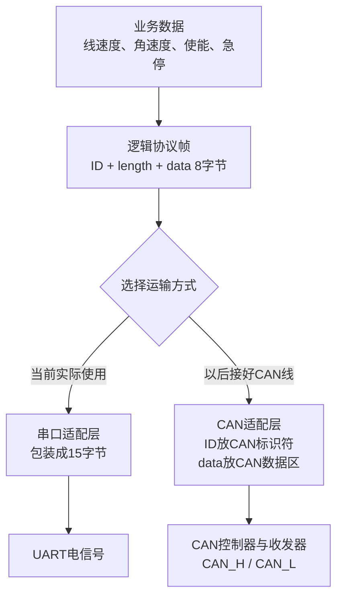
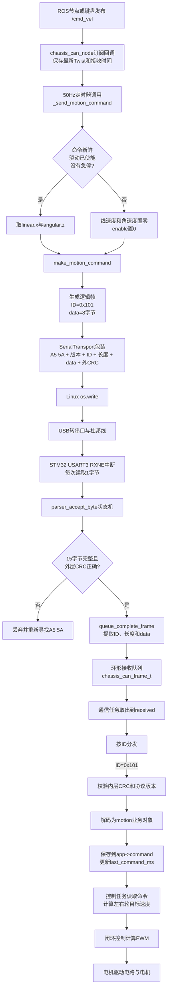
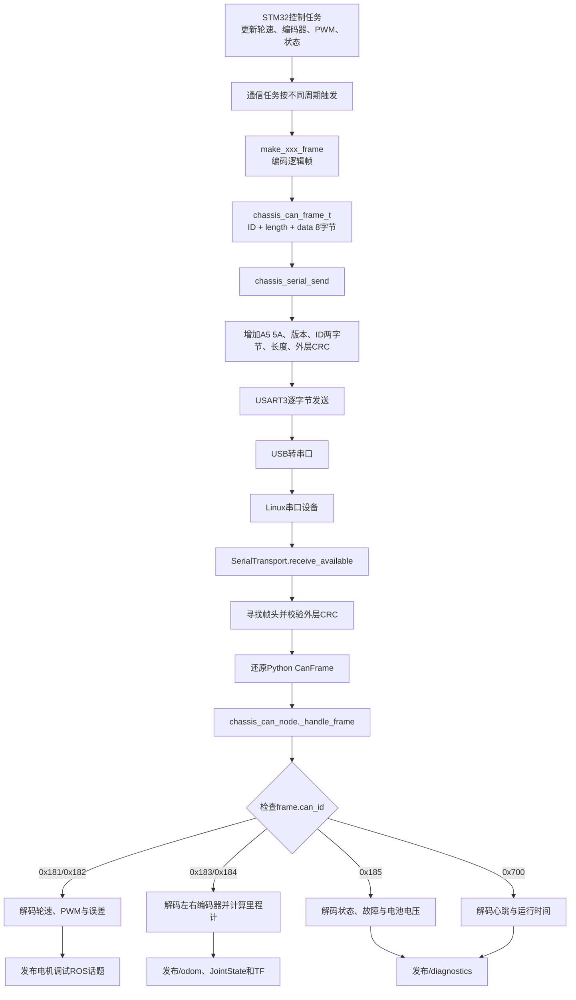
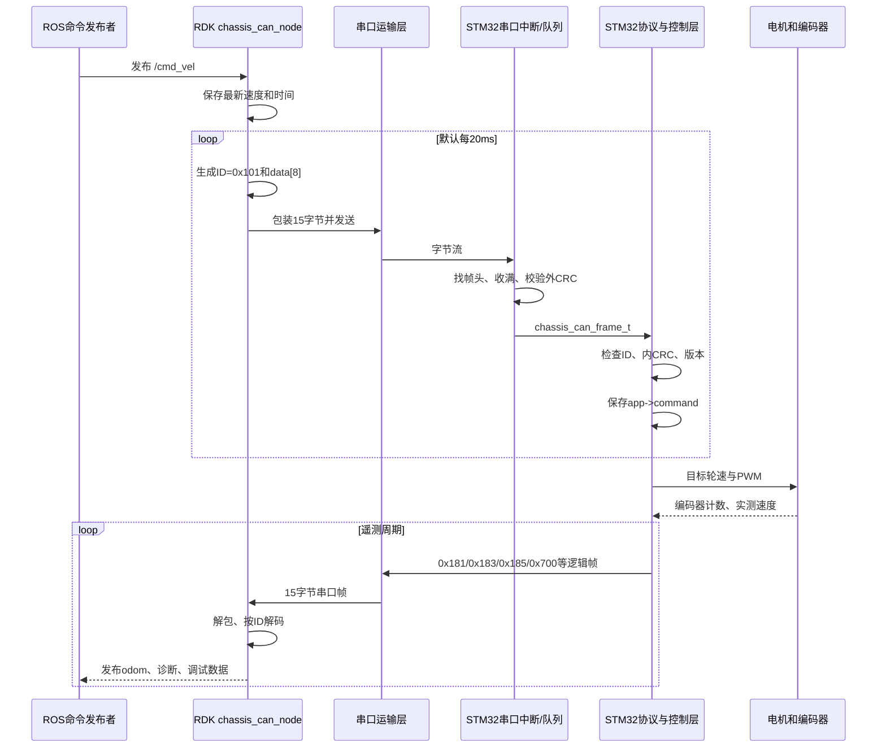
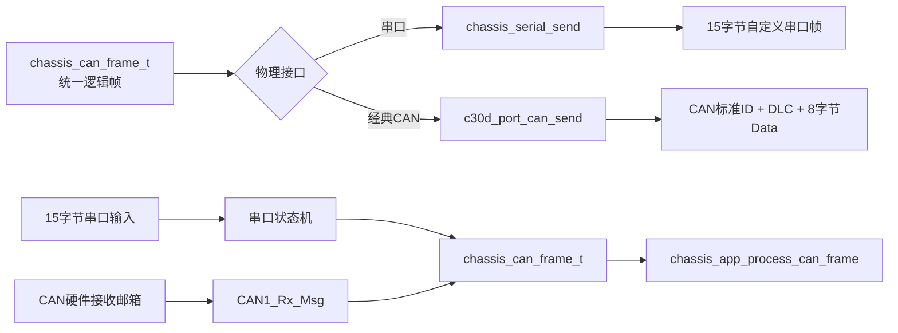

# 下位机第 3 模块：STM32 串口通信模块

> 本文件是该模块在旧任务中的完整归档：保留首次讲解正文，并把首次文档之后的专项追问统一融合在同一文件中。以后无需回到原任务查找。

## 本模块归档内容

- 首次讲解来源：`docs/17_STM32下位机串口通信代码深度详解.md`
- 后续追问来源：`docs/18_小端序_0x101_CAN与上下位机数据流详解.md`

---

# 第一部分：首次完整讲解

# STM32 下位机串口通信代码深度详解

## 1. 本文讲解范围

本文专门讲当前 C30D 串口版下位机工程的第三个模块——串口通信。对应工程：

```text
keil_project/R550_C30D_SERIAL_MOTOR/
```

你已经理解的前两个模块是：

1. 系统启动与硬件初始化；
2. FreeRTOS 任务调度。

串口模块正好连接这两个模块与后面的控制模块：

```text
模块1：systemInit() 初始化 USART3 硬件
                 ↓
模块3：USART3 中断接收、组帧、入队
                 ↓
模块2：FreeRTOS 调度 chassis_serial_task
                 ↓
协议模块：解析 logical_id 和 data[8]
                 ↓
控制模块：更新运动命令、参数或系统动作
                 ↓
电机控制任务：使用最新命令计算 PWM
```

反方向的数据流是：

```text
编码器/PI/状态机产生遥测数据
                 ↓
协议模块编码成 logical_id + data[8]
                 ↓
串口模块包装成 15 字节帧
                 ↓
USART3 逐字节发送
                 ↓
板载 USB 转串口芯片
                 ↓
RDK X5 的 /dev/serial/by-id/...0002...
                 ↓
Python 解码并发布 ROS 2 话题
```

本文会讲清：UART/USART、波特率、8N1、中断、寄存器、状态机、帧头、粘包、半包、CRC、小端序、环形队列、并发、互斥锁、FreeRTOS 周期任务以及上下位机对应关系。

## 2. 先区分几个容易混淆的概念

### 2.1 “串口”是一个总称

日常说的“串口”可能指：

- MCU 内部的 UART/USART 外设；
- 板上的 TX/RX 引脚；
- USB 转串口芯片；
- Linux 中的 `/dev/ttyACM1`；
- 自己设计的应用层报文协议。

这些不是同一层。

当前实际链路可以分为：

```text
应用层：速度、参数、状态、心跳各字段怎样排列
封装层：A5 5A + logical_id + data[8] + CRC，共15字节
串行层：115200、8N1，按位发送
MCU硬件层：STM32 USART3，PD8/PD9
转换层：WCH USB Single Serial 芯片
Linux设备层：/dev/serial/by-id/usb-WCH...0002-if00
ROS层：/cmd_vel、/diagnostics、/odom 等
```

排查问题时必须先判断是哪个层的问题。

### 2.2 UART 与 USART

UART 是异步通用收发器，USART 还可以支持同步模式。当前 STM32 外设名为 `USART3`，但使用的是异步 UART 方式：没有外部时钟线，双方根据约定的波特率自行采样。

所以本文中“UART”和“USART3 串口”都指当前这条异步链路。

### 2.3 USB 不是 UART

RDK 插入的是 USB 设备，STM32 侧使用的是 USART3。中间的 WCH 芯片负责协议转换：

```text
RDK USB 数据 ⇄ WCH 转换芯片 ⇄ STM32 UART TX/RX
```

Linux 因此创建一个串口设备文件。RDK Python 打开的是设备文件，不是直接操作 STM32 的 PD8/PD9。

### 2.4 UART TTL、RS-232 与 RS-485 不是一回事

MCU UART 引脚通常是逻辑电平信号；传统 RS-232 使用不同电压范围和极性；RS-485 是差分总线。三者不能因为都叫“串口”就直接相连。

本车已经通过板载 USB 转串口链路连接，不需要把 PC 的传统 RS-232 电压直接接到 STM32 引脚。

## 3. UART 怎样把一个字节传出去

### 3.1 异步通信为什么需要起始位和停止位

空闲时线路保持高电平。发送一个字节时：

```text
起始位  数据位0 数据位1 ... 数据位7  停止位
   0       b0      b1          b7       1
```

接收端看到从高到低的跳变，知道一个新字符开始，再按照波特率在各数据位中间采样。

### 3.2 当前配置：115200-8N1

`8N1` 表示：

```text
8：8个数据位
N：No parity，无奇偶校验位
1：1个停止位
```

每个数据字节实际在线路上传输：

```text
1个起始位 + 8个数据位 + 1个停止位 = 10 bit
```

### 3.3 波特率

当前波特率：

```text
115200 bit/s
```

8N1 每个有效字节消耗 10 bit，所以理论最大有效字节率：

```text
115200 / 10 = 11520 byte/s
```

一帧 15 字节需要：

```text
15 × 10 / 115200 ≈ 0.001302 s
                  ≈ 1.302 ms
```

这也是后面分析任务阻塞时间和带宽的基础。

### 3.4 全双工

UART 有独立的 TX 与 RX：

```text
STM32 TX → RDK RX方向
STM32 RX ← RDK TX方向
```

因此两个方向理论上可以同时传输。不能把两个方向的占用简单相加成同一条线的占用，但 USB 转串口芯片、CPU 和软件仍需同时处理两侧数据。

## 4. 当前串口相关文件

### 4.1 硬件初始化和真正中断符号

```text
BALANCE/system.c
HARDWARE/usartx.c
HARDWARE/usartx.h
```

负责：

- 在 `systemInit()` 中调用 `uart3_init(115200)`；
- 配置 PD8/PD9、USART3 和 NVIC；
- 提供真正由中断向量调用的 `USART3_IRQHandler()`；
- 提供单字节发送函数 `usart3_send()`。

### 4.2 新串口外层传输模块

```text
CHASSIS_SERIAL/inc/chassis_serial_transport.h
CHASSIS_SERIAL/src/chassis_serial_transport.c
```

负责：

- 逐字节接收；
- 帧头同步；
- 15 字节组帧；
- 外层 CRC 检查；
- 接收环形队列；
- 逻辑帧与 15 字节帧互相转换。

### 4.3 8 字节逻辑协议模块

```text
CHASSIS_SERIAL/inc/chassis_can_protocol.h
CHASSIS_SERIAL/src/chassis_can_protocol.c
```

负责：

- logical ID 定义；
- 运动、参数、系统命令的编码和解码；
- 遥测报文编码；
- 小端整数和浮点数处理；
- 内层 CRC-8。

### 4.4 FreeRTOS 串口任务

```text
CHASSIS_SERIAL/src/chassis_tasks.c
```

负责：

- 每 2 ms 从接收队列取完已有报文；
- 把命令交给底盘应用层；
- 返回参数/系统命令应答；
- 按不同周期生成并发送遥测。

### 4.5 与控制模块的接口

```text
CHASSIS_SERIAL/src/chassis_app.c
CHASSIS_SERIAL/src/c30d_chassis_port.c
```

`c30d_chassis_port.c` 提供统一传输接口；`chassis_app.c` 根据 logical ID 解释命令并修改控制状态。

## 5. USART3 硬件初始化逐句讲解

调用位置：

```c
void systemInit(void)
{
    ...
    uart3_init(115200);
    ...
}
```

实现位于 `HARDWARE/usartx.c`。

### 5.1 创建配置结构体

```c
GPIO_InitTypeDef GPIO_InitStructure;
USART_InitTypeDef USART_InitStructure;
NVIC_InitTypeDef NVIC_InitStructure;
```

STM32 标准外设库用结构体收集一组配置，再一次写入对应寄存器。这比应用代码直接拼每个寄存器位更容易阅读。

### 5.2 打开外设时钟

```c
RCC_AHB1PeriphClockCmd(RCC_AHB1Periph_GPIOD, ENABLE);
RCC_APB1PeriphClockCmd(RCC_APB1Periph_USART3, ENABLE);
```

STM32 为降低功耗，上电后许多外设时钟默认关闭。没有开启时钟就配置 GPIO 或 USART，寄存器写入不会产生预期硬件行为。

这里：

- GPIOD 位于 AHB1 总线；
- USART3 位于 APB1 总线。

### 5.3 把 PD8、PD9映射为 USART3

```c
GPIO_PinAFConfig(GPIOD, GPIO_PinSource8, GPIO_AF_USART3);
GPIO_PinAFConfig(GPIOD, GPIO_PinSource9, GPIO_AF_USART3);
```

STM32 一个引脚可有 GPIO、定时器、串口等复用功能。这里把：

```text
PD8 → USART3_TX
PD9 → USART3_RX
```

仅把模式设为复用还不够，还必须用 AF 映射选择具体外设。

### 5.4 GPIO 配置

```c
GPIO_InitStructure.GPIO_Pin = GPIO_Pin_8 | GPIO_Pin_9;
GPIO_InitStructure.GPIO_Mode = GPIO_Mode_AF;
GPIO_InitStructure.GPIO_OType = GPIO_OType_PP;
GPIO_InitStructure.GPIO_Speed = GPIO_Speed_50MHz;
GPIO_InitStructure.GPIO_PuPd = GPIO_PuPd_UP;
GPIO_Init(GPIOD, &GPIO_InitStructure);
```

逐项含义：

- `GPIO_Pin_8 | GPIO_Pin_9`：用按位或一次选中两个引脚；
- `GPIO_Mode_AF`：复用功能模式；
- `GPIO_OType_PP`：推挽输出；
- `GPIO_Speed_50MHz`：GPIO 输出速度等级，不是波特率；
- `GPIO_PuPd_UP`：内部上拉，使空闲状态更稳定；
- `GPIO_Init()`：将配置写入 GPIOD 寄存器。

RX 引脚由外部驱动，但标准库仍使用同一 GPIO 配置结构完成复用配置。

### 5.5 NVIC 中断配置

```c
NVIC_InitStructure.NVIC_IRQChannel = USART3_IRQn;
NVIC_InitStructure.NVIC_IRQChannelPreemptionPriority = 2;
NVIC_InitStructure.NVIC_IRQChannelSubPriority = 0;
NVIC_InitStructure.NVIC_IRQChannelCmd = ENABLE;
NVIC_Init(&NVIC_InitStructure);
```

NVIC 是 Cortex-M 的嵌套向量中断控制器。这里允许 USART3 产生 CPU 中断。

抢占优先级与子优先级由 `NVIC_PriorityGroup_4` 的分组方式解释。数值越小通常硬件中断优先级越高。

注意：

```text
NVIC 中断优先级 ≠ FreeRTOS 任务优先级
```

FreeRTOS 当前控制任务优先级 6、串口任务优先级 5，数值越大任务越优先；这是另一套调度体系。

### 5.6 USART 参数

```c
USART_InitStructure.USART_BaudRate = bound;
USART_InitStructure.USART_WordLength = USART_WordLength_8b;
USART_InitStructure.USART_StopBits = USART_StopBits_1;
USART_InitStructure.USART_Parity = USART_Parity_No;
USART_InitStructure.USART_HardwareFlowControl = USART_HardwareFlowControl_None;
USART_InitStructure.USART_Mode = USART_Mode_Rx | USART_Mode_Tx;
USART_Init(USART3, &USART_InitStructure);
```

这就是 115200-8N1、无 RTS/CTS 硬件流控、允许收发。

上下位机这些参数必须一致。波特率不同会导致采样位置不断偏移，通常表现为 CRC 错误、乱码或完全收不到完整帧。

### 5.7 开启 RXNE 中断和 USART

```c
USART_ITConfig(USART3, USART_IT_RXNE, ENABLE);
USART_Cmd(USART3, ENABLE);
```

`RXNE` 是 Receive Data Register Not Empty，即接收数据寄存器非空。每收到一个字节，硬件设置 RXNE，NVIC 进入 `USART3_IRQHandler()`。

当前没有开启 TXE 发送中断，也没有使用 DMA；发送采用轮询。

## 6. 从硬件中断向量到新协议处理函数

### 6.1 真正的中断入口

启动文件的中断向量表通过符号名寻找：

```c
USART3_IRQHandler
```

当前 `HARDWARE/usartx.c` 中：

```c
int USART3_IRQHandler(void)
{
    extern void CHASSIS_USART3_IRQHandler(void);
    CHASSIS_USART3_IRQHandler();
    return 0;

#if 0
    /* 原厂旧协议代码 */
#endif
}
```

这里做了一个桥接：中断向量仍调用原工程已有的函数名，但它立即转入新模块。

### 6.2 为什么保留旧代码却不会执行

```c
#if 0
    ...
#endif
```

这是 C 预处理条件编译。条件为 0，编译器根本不会把其中代码编入固件。

所以当前不是“新旧协议同时运行”，而是：

```text
旧的 11 字节协议源码还在文件里供对照
实际固件只运行新的 15 字节协议
```

### 6.3 中断函数返回类型的工程备注

当前原厂头文件和实现将中断写成：

```c
int USART3_IRQHandler(void)
```

CMSIS 常见规范签名是：

```c
void USART3_IRQHandler(void)
```

当前工程已按现状编译并运行，返回值也没有调用者使用；但从代码规范和可移植性角度，后续整理原厂代码时可统一改成 `void`，同时修改声明。这里属于历史代码风格，不是新协议的核心设计。

## 7. 接收中断函数深入讲解

新实现：

```c
void CHASSIS_USART3_IRQHandler(void)
{
    uint8_t received_byte;

    if (USART_GetITStatus(USART3, USART_IT_RXNE) != RESET)
    {
        received_byte = (uint8_t)USART_ReceiveData(USART3);
        parser_accept_byte(received_byte);
    }

    if (USART_GetFlagStatus(USART3, USART_FLAG_ORE) != RESET)
    {
        volatile uint16_t status_value = USART3->SR;
        volatile uint16_t data_value = USART3->DR;
        (void)status_value;
        (void)data_value;
    }
}
```

### 7.1 `USART_GetITStatus()`

它同时判断对应状态和中断使能。只有 RXNE 中断真的有效时才读取数据。

### 7.2 `USART_ReceiveData()`

USART 接收硬件完成 10 bit 采样后，把 8 个数据位放入 DR 数据寄存器并设置 RXNE。读取 DR 后 RXNE 被清除，硬件可以接收下一个字节。

### 7.3 为什么中断中只处理一个字节

普通 STM32 USART 没有很深的硬件接收 FIFO。RXNE 表示当前有一个字节待取。中断尽快读取并交给轻量解析器，然后退出。

### 7.4 ORE 是什么

`ORE` 是 Overrun Error。若上一个字节还没从 DR 取走，下一个字节又到达，硬件无法正常保存所有数据，就发生溢出。

代码读取 SR 和 DR 清除 ORE，避免中断标志一直存在。发生 ORE 意味着至少有字节可能丢失；解析器后续依靠 `A5 5A` 帧头重新同步。

当前 `g_queue_overrun` 只统计软件接收队列满，不统计 USART 硬件 ORE，这是两个不同概念。

### 7.5 为什么不在中断里直接控制电机

中断里如果执行：

- 浮点运动学；
- PI 计算；
- Flash 擦写；
- 长时间等待互斥锁；
- 大量阻塞发送；

会拉长中断时间，影响编码器、系统时基和 FreeRTOS。当前中断只做：

```text
读1字节 → 推进解析状态 → 完整帧入小队列
```

复杂处理放到任务上下文，这是合理的实时系统分工。

## 8. 为什么串口是“字节流”而不是“报文流”

UART 只传连续字节，不知道应用层哪里是一帧：

```text
A5 5A 01 ... EB A5 5A 01 ... 4C
```

操作系统或中断可能每次给你：

```text
1个字节
半帧
恰好1帧
连续多帧
上一帧后半 + 下一帧前半
```

常见概念：

- 半包：一次只收到一帧的一部分；
- 粘包：一次缓存中连续出现多帧；
- 错位：从一帧中间开始接收；
- 噪声字节：合法帧之间混入无关字节。

UART 本身不会替你解决这些问题，所以需要应用层帧格式和解析状态机。

## 9. 15 字节外层帧

定义：

```text
CHASSIS_SERIAL/inc/chassis_serial_transport.h
```

| 偏移 | 长度 | 内容 | 说明 |
|---:|---:|---|---|
| 0 | 1 | `0xA5` | 帧头第1字节 |
| 1 | 1 | `0x5A` | 帧头第2字节 |
| 2 | 1 | `0x01` | 串口外层协议版本 |
| 3 | 2 | logical ID | 小端序 |
| 5 | 1 | `0x08` | 逻辑数据长度 |
| 6 | 8 | `data[8]` | 逻辑协议负载 |
| 14 | 1 | CRC-8 | 对偏移2～13共12字节计算 |

相关常量：

```c
#define CHASSIS_SERIAL_SOF0          0xA5U
#define CHASSIS_SERIAL_SOF1          0x5AU
#define CHASSIS_SERIAL_VERSION       0x01U
#define CHASSIS_SERIAL_FRAME_LENGTH  15U
#define CHASSIS_SERIAL_QUEUE_LENGTH  8U
```

### 9.1 为什么帧头用两个字节

单个字节偶然出现在负载中的概率较高。连续出现固定 `A5 5A` 的概率更低，有助于从噪声和错位中找回边界。

帧头不是绝对保证，因为合法数据也可能恰好包含 `A5 5A`；最终还要结合版本、长度和 CRC 判断。

### 9.2 为什么有版本

未来若改变外层布局，可把版本改为 2。旧固件看到不支持的版本会提前丢弃，而不是按旧格式错误解释。

外层版本和运动命令 `data[5]` 中的逻辑协议版本是两个层级。

### 9.3 logical ID 为什么保留 CAN ID 风格

项目的控制协议原本抽象为：

```text
11位 logical ID + 固定8字节 data
```

CAN 版可直接作为标准 CAN 帧发送；串口版把它装进 15 字节外壳。这样：

```text
控制算法和报文含义不变
只更换最外面的传输模块
```

所以结构名仍叫 `chassis_can_frame_t`，不代表当前物理层使用 CAN。

## 10. 字节解析状态机的内部变量

```c
static uint8_t g_parser_buffer[15];
static uint8_t g_parser_count = 0U;
```

`g_parser_buffer` 保存正在拼接的一帧；`g_parser_count` 表示已经接受了多少个字节，同时也代表下一个字节写入的位置。

可以把解析器看成几个状态：

```text
count=0：等待 A5
count=1：已经有 A5，等待 5A
count=2：等待版本
count=3～5：接收 ID 和长度
count=6～14：接收 data[8] 和外层 CRC
count=15：校验并提交，然后回到等待帧头
```

代码没有写 `enum` 状态，而是用计数值隐式表达状态。

## 11. `parser_reset_with_possible_header()` 深入讲解

```c
static void parser_reset_with_possible_header(uint8_t byte)
{
    if (byte == CHASSIS_SERIAL_SOF0)
    {
        g_parser_buffer[0] = byte;
        g_parser_count = 1U;
    }
    else
    {
        g_parser_count = 0U;
    }
}
```

它不是简单把计数永远清零，而是检查“导致失败的当前字节本身会不会是下一帧的 A5”。

例如收到：

```text
A5 A5 5A ...
```

第一个 A5 后，本来期待 5A，却又收到 A5。第二个 A5 很可能是新帧真正的开头。如果直接清零并丢掉它，随后到来的 5A 也会被当垃圾，整帧丢失。

当前函数会保留第二个 A5，使下一字节 5A 能继续组帧。这是一种快速重同步技巧。

## 12. `parser_accept_byte()` 分支逐步讲解

### 12.1 状态0：等待第一个帧头

```c
if (g_parser_count == 0U)
{
    parser_reset_with_possible_header(byte);
    return;
}
```

不是 A5 就忽略，是 A5 就保存并进入 `count=1`。

### 12.2 状态1：等待第二个帧头

```c
if (g_parser_count == 1U)
{
    if (byte == CHASSIS_SERIAL_SOF1)
    {
        g_parser_buffer[1] = byte;
        g_parser_count = 2U;
    }
    else
    {
        parser_reset_with_possible_header(byte);
    }
    return;
}
```

收到 5A 才确认双字节帧头，否则重新判断当前字节是否为新的 A5。

### 12.3 接收其余字节

```c
g_parser_buffer[g_parser_count] = byte;
g_parser_count++;
```

先写入当前索引，再把已接收数量加 1。

### 12.4 尽早检查版本

```c
if ((g_parser_count == 3U) &&
    (g_parser_buffer[2] != CHASSIS_SERIAL_VERSION))
```

刚收完偏移 2 的版本字节就检查。错误时不必继续浪费时间收剩余 12 字节。

### 12.5 尽早检查长度

```c
if ((g_parser_count == 6U) &&
    (g_parser_buffer[5] != CHASSIS_CAN_DLC))
```

刚收完偏移 5 的长度字节，要求固定为 8。

### 12.6 收满15字节后检查外层 CRC

```c
if (g_parser_count == CHASSIS_SERIAL_FRAME_LENGTH)
{
    calculated_crc = chassis_crc8(&g_parser_buffer[2], 12U);
    if (calculated_crc == g_parser_buffer[14])
    {
        queue_complete_frame();
    }
    parser_reset_with_possible_header(byte);
}
```

CRC 输入：

```text
buffer[2] ... buffer[13]
共12字节
```

不包含：

- `A5 5A` 帧头；
- `buffer[14]` 中存放的 CRC 本身。

合法则入队；非法直接丢弃。无论成功失败都重新寻找下一帧。

### 12.7 未直接检查 logical ID 的原因与边界

接收外层解析器验证版本、长度和 CRC，但没有在这里限制 ID 必须 `<=0x7FF`。之后应用层只处理已知 ID，未知 ID 会被忽略。

发送端 `chassis_serial_send()` 会拒绝大于 `0x7FF` 的 ID；RDK 接收端也检查该范围。若以后强化输入校验，可以在 STM32 外层解析阶段加入 ID 范围检查。

## 13. CRC-8/ATM 深入讲解

### 13.1 CRC 解决什么问题

串行链路可能因噪声、丢字节或错位产生错误。如果只靠帧头，错误数据仍可能被当成命令。

发送端根据内容计算一个 CRC 字节；接收端对同样内容重新计算：

```text
重新计算值 == 收到的CRC → 认为帧大概率完整
重新计算值 != 收到的CRC → 丢弃
```

CRC 是检错码，不是加密，也不能证明发送者身份。

### 13.2 当前参数

```text
算法：CRC-8/ATM
多项式：0x07
初始值：0x00
输入不反射
输出不反射
最终异或：0x00
```

上下位机只写“CRC-8”还不够，所有这些参数都必须一致。

### 13.3 函数逐层理解

```c
uint8_t chassis_crc8(const uint8_t *data, uint8_t length)
{
    uint8_t crc = 0U;

    for (i = 0U; i < length; ++i)
    {
        crc ^= data[i];
        for (bit = 0U; bit < 8U; ++bit)
        {
            if ((crc & 0x80U) != 0U)
                crc = (uint8_t)((crc << 1U) ^ 0x07U);
            else
                crc = (uint8_t)(crc << 1U);
        }
    }
    return crc;
}
```

对于每个输入字节：

1. 与当前 CRC 异或；
2. 重复处理 8 个 bit；
3. 检查最高位；
4. 左移；
5. 若最高位为 1，再与多项式 `0x07` 异或；
6. `uint8_t` 使结果始终保留低 8 位。

### 13.4 为什么有外层和内层 CRC

外层 CRC 覆盖：

```text
版本 + ID + 长度 + 完整data[8]
```

部分逻辑报文又把 `data[7]` 作为内层 CRC，覆盖 `data[0..6]`。内层 CRC 让同一逻辑协议在 CAN 传输时也有应用层校验。

但不是所有遥测都有内层 CRC：

- 运动命令、参数、系统、编码器、状态、应答、心跳有内层 CRC；
- 轮速 `0x181` 和 PWM/误差 `0x182` 的 8 字节全部用于数据，串口版依赖外层 CRC。

串口版无论哪种 logical ID，始终有外层 CRC。

## 14. 从15字节帧转换为逻辑帧

### 14.1 逻辑帧结构

```c
typedef struct
{
    uint32_t id;
    uint8_t length;
    uint8_t data[8];
} chassis_can_frame_t;
```

这个结构是 MCU 内存中的对象，不会把结构体原样通过串口发送。串口格式是人工规定的 15 字节，避免编译器填充和平台差异。

### 14.2 `queue_complete_frame()` 的转换

```c
destination->id = (uint32_t)g_parser_buffer[3] |
                  ((uint32_t)g_parser_buffer[4] << 8U);
destination->length = 8;
memcpy(destination->data, &g_parser_buffer[6], 8);
```

ID 是小端：

```text
buffer[3] = 低8位
buffer[4] = 高8位
```

例如 logical ID `0x0101`：

```text
发送字节：01 01
恢复：0x01 | (0x01 << 8) = 0x0101
```

`memcpy()` 把偏移 6～13 的 8 字节复制到逻辑帧。

## 15. 小端序、补码与单位缩放

### 15.1 什么是小端序

多字节数必须规定哪个字节先传。小端序把最低有效字节放在前面。

例如 16 位整数 `0x1234`：

```text
小端发送：34 12
大端发送：12 34
```

上下位机当前都使用小端。

### 15.2 有符号负数

`int16_t` 通常使用二进制补码。例如 `-50` 的 16 位表示是：

```text
0xFFCE
```

小端发送：

```text
CE FF
```

接收端先组合为 `uint16_t`，再转换为 `int16_t`，恢复负数。

### 15.3 为什么速度乘1000

运动帧只有 8 字节，不直接发送 C 结构体浮点数，而把：

```text
m/s × 1000 → mm/s整数
rad/s × 1000 → mrad/s整数
```

例如：

```text
0.05 m/s → 50 → int16 → 32 00
-0.05 m/s → -50 → int16 → CE FF
```

接收后除以 1000 恢复 SI 单位。

好处：布局明确、易跨语言、易抓包观察。代价是分辨率固定为 0.001 m/s 或 0.001 rad/s，范围受 int16 限制。

### 15.4 参数为什么用 float

参数帧要传 `Kp=3000.0`、轮径 `0.065` 等不同量级数值，因此使用 4 字节 IEEE-754 单精度浮点的原始位模式。

STM32 端：

```c
memcpy(&raw, &value, sizeof(raw));
```

再按小端拆成 4 字节。使用 `memcpy` 避免违反 C 的严格别名规则。

RDK Python 使用：

```python
struct.pack("<f", value)
```

两端都假定 32 位 IEEE-754 单精度，这是当前 STM32F407 和 Python `struct` 的对应格式。

## 16. 接收环形队列为什么需要存在

中断收到完整帧时，FreeRTOS 串口任务可能正在：

- 被控制任务抢占；
- 发送遥测；
- 等待互斥锁；
- 处理上一条参数命令。

如果只设置一个“最新帧”变量，新帧可能覆盖旧帧。环形队列让中断可以先缓存多个完整帧，任务稍后按顺序处理。

## 17. 环形队列的数据结构

```c
static chassis_can_frame_t g_receive_queue[8];
static volatile uint8_t g_queue_write = 0U;
static volatile uint8_t g_queue_read = 0U;
static volatile uint16_t g_queue_overrun = 0U;
```

含义：

- `write`：中断下一次写入的位置；
- `read`：任务下一次读取的位置；
- `read == write`：队列为空；
- `overrun`：队列满时累计丢帧数。

索引到末尾后取模回到 0：

```c
next = (current + 1) % 8;
```

这就是“环形”。

### 17.1 为什么数组8格只能装7帧

当前设计用：

```text
read == write 表示空
next_write == read 表示满
```

必须永远空出一个槽位，才能区分空和满。因此有效容量：

```text
8 - 1 = 7帧
```

若想真正使用8格，需要额外保存元素数量或满标志。

## 18. `queue_complete_frame()` 的并发安全

```c
next_write = (g_queue_write + 1U) % 8U;
if (next_write == g_queue_read)
{
    g_queue_overrun++;
    return;
}

destination = &g_receive_queue[g_queue_write];
/* 完整写入 id、length、data */
__DMB();
g_queue_write = next_write;
```

### 18.1 单生产者、单消费者

当前恰好是：

```text
唯一生产者：USART3中断
唯一消费者：chassis_serial_task
```

中断只修改写指针，任务只修改读指针。生产者不会写消费者正在读取的槽位，因为满判断会阻止它追上读指针。

这使得简单无锁 SPSC 队列可行。

### 18.2 `volatile` 的作用

读写索引可能在当前执行上下文之外变化。`volatile` 要求每次从内存实际读取/写入，不能假设变量不会变化。

但 `volatile` 不是互斥锁，也不自动保证复杂多线程操作原子性。

### 18.3 `__DMB()` 的作用

DMB 是 Data Memory Barrier，数据内存屏障。

生产者必须保证：

```text
先完整写入帧内容
再公布新的write指针
```

否则消费者可能看到 write 已推进，却读到尚未完整写好的槽位。

消费者同样在复制完帧后用屏障，再推进 read 指针，避免生产者过早把该槽位视为可重用。

### 18.4 队列满为什么丢最新帧

当前策略保留已经排队的旧帧，丢掉新到帧。这能保持已缓存报文的顺序，参数命令不会因插队而乱序。

运动控制还有命令超时；RDK 以 50 Hz 重复发送最新命令，丢一个运动帧通常下一周期会补上。

如果大量持续丢帧，仍说明任务或带宽设计有问题，不能依赖重发掩盖。

## 19. `chassis_serial_receive()` 深入讲解

```c
int chassis_serial_receive(chassis_can_frame_t *frame)
{
    if ((frame == 0) || (g_queue_read == g_queue_write))
        return 0;

    *frame = g_receive_queue[g_queue_read];
    __DMB();
    g_queue_read = (g_queue_read + 1U) % 8U;
    return 1;
}
```

### 19.1 参数为什么是指针

调用者提供一个结构体地址：

```c
chassis_can_frame_t received;
chassis_serial_receive(&received);
```

函数把队首帧复制进去，并用返回值表示是否成功：

```text
1 = 取到一帧
0 = 空队列或参数无效
```

### 19.2 `frame == 0`

在 C 中 `0` 用作空指针。若调用者没有提供有效存储地址，函数直接返回，避免访问非法地址。

### 19.3 为什么是非阻塞接口

队列为空时立即返回 0，不让任务睡死等待。这使串口任务可以继续按时发送状态和心跳。

上层用 `while` 一次取完已有帧：

```c
while (c30d_port_transport_receive(&received))
{
    ...
}
```

## 20. 硬件适配层为何再包一层

```c
int c30d_port_transport_receive(chassis_can_frame_t *frame)
{
    return chassis_serial_receive(frame);
}

int c30d_port_transport_send(const chassis_can_frame_t *frame)
{
    return chassis_serial_send(frame);
}
```

目前看只是转调用，但它隔离了底盘业务代码和具体传输方式：

```text
chassis_tasks 只依赖 c30d_port_transport_*
串口版适配到 USART3
CAN版可适配到 CAN1
```

这也是为什么控制任务无需到处出现 `USART3` 寄存器。

## 21. FreeRTOS 串口任务如何消费命令

任务：

```c
void chassis_serial_task(void *argument)
```

周期：

```c
#define SERIAL_POLL_PERIOD_MS 2U
```

主循环：

```c
for (;;)
{
    vTaskDelayUntil(&last_wake_time, pdMS_TO_TICKS(2));
    now_ms = c30d_port_get_time_ms();

    while (c30d_port_transport_receive(&received))
    {
        ...处理全部已缓存报文...
    }

    ...按周期发送遥测...
}
```

### 21.1 为什么每2ms轮询

RDK 运动帧以 50 Hz，即每 20 ms 发送一次。2 ms 轮询远快于命令周期，正常情况下接收延迟较小。

接收字节本身不等轮询：每个字节到来时中断已经立即组帧；2 ms 只是任务从完整帧队列取走的周期。

### 21.2 为什么一次取完队列

参数下发或系统操作可能形成突发报文。如果一次只取一帧，积压可能越来越多。`while` 会一直取到空，快速释放 7 帧有效容量。

### 21.3 与控制模块共享数据为什么需要互斥锁

串口任务会修改：

```text
最新运动命令
最后命令时间
参数
故障和里程计系统动作
```

控制任务同时读取/修改 `g_chassis_app`。因此：

```c
if (xSemaphoreTake(g_chassis_mutex, pdMS_TO_TICKS(2U)) == pdTRUE)
{
    chassis_app_process_can_frame(...);
    xSemaphoreGive(g_chassis_mutex);
}
```

互斥锁保护应用状态，不保护中断环形队列；它们是两套不同并发机制。

### 21.4 拿不到互斥锁会怎样

当前该帧已经从接收队列取出。如果 2 ms 内拿不到应用互斥锁，这一帧不会重新放回队列，因此会被丢弃。

正常控制任务临界区很短，发生概率应低；RDK 的运动帧持续重发，参数层也有 200 ms 超时和最多 3 次重试。

这是当前实现的明确行为，后续若需要更强可靠性，可在拿锁失败时保留当前帧或使用专用命令队列。

## 22. 命令交给 `chassis_app_process_can_frame()`

```c
action = chassis_app_process_can_frame(
    &g_chassis_app,
    &received,
    now_ms,
    &reply,
    &reply_ready);
```

输入：

- 当前底盘应用状态；
- 收到的逻辑帧；
- 当前时间；
- 用于生成应答的结构体；
- 是否需要应答的标志。

返回 `action` 用于处理需要具体硬件操作的动作，例如保存 Flash。

它按 ID 分流：

```text
0x101 → 运动命令
0x102 → 参数命令
0x103 → 系统命令
其他  → 当前下位机忽略
```

## 23. 运动命令 `0x101` 深入讲解

### 23.1 data[8]布局

| data偏移 | 长度 | 含义 |
|---:|---:|---|
| 0 | 2 | 线速度，int16，mm/s，小端 |
| 2 | 2 | 角速度，int16，mrad/s，小端 |
| 4 | 1 | flags：bit0使能，bit1急停 |
| 5 | 1 | 逻辑协议版本，当前1 |
| 6 | 1 | sequence |
| 7 | 1 | 内层CRC，覆盖data[0..6] |

### 23.2 解码条件

```c
if (frame->id != 0x101 ||
    inner_crc_invalid ||
    frame->data[5] != 1)
{
    return 0;
}
```

合法后：

```c
command->linear_mps = get_i16_le(&data[0]) / 1000.0f;
command->angular_radps = get_i16_le(&data[2]) / 1000.0f;
command->enable = (data[4] & 0x01) != 0;
command->emergency_stop = (data[4] & 0x02) != 0;
command->sequence = data[6];
```

### 23.3 控制应用如何保存

```c
app->command = motion;
app->last_command_ms = now_ms;
app->has_received_command = 1U;
```

若急停位为 1：

```c
app->latched_faults |= CHASSIS_FAULT_ESTOP;
```

这里只更新命令状态，不在串口任务中直接算 PWM。100 Hz 控制任务下次运行时读取最新命令。

### 23.4 为什么运动命令不逐帧应答

运动命令 50 Hz 周期发送，若每帧应答会增加带宽和延迟。状态帧中带有 `last_command_sequence`，上位机可以间接看到 STM32 最近处理的序号。

安全依赖周期更新和超时，而不是每个速度帧等待 ACK。

## 24. 一个真实运动帧逐字节分析

条件：

```text
linear = 0.05 m/s
angular = 0.0 rad/s
enable = true
emergency_stop = false
sequence = 7
```

Python 与 C 协议测试得到逻辑数据：

```text
32 00 00 00 01 01 07 A0
```

解释：

```text
32 00  → int16 0x0032 = 50 → 0.050 m/s
00 00  → 角速度0
01     → bit0=1，使能；bit1=0，无急停
01     → 逻辑协议版本1
07     → sequence 7
A0     → 对前7个data字节计算的内层CRC
```

logical ID 是 `0x101`，整个15字节串口帧为：

```text
A5 5A 01 01 01 08 32 00 00 00 01 01 07 A0 EB
```

逐项：

```text
A5 5A              外层帧头
01                 外层版本
01 01              ID 0x0101，小端
08                 data长度
32 00 00 00 01 01 07 A0   data[8]
EB                 对 01 01 01 08 ... A0 这12字节的外层CRC
```

这帧在线路上约需要 1.302 ms。

## 25. 参数命令 `0x102`

data布局：

| 偏移 | 长度 | 含义 |
|---:|---:|---|
| 0 | 1 | parameter_id |
| 1 | 1 | 0=读，1=写 |
| 2 | 4 | float 参数值，小端 |
| 6 | 1 | sequence |
| 7 | 1 | 内层CRC |

STM32 处理流程：

```text
检查内层CRC
→ 检查参数ID
→ 运行中拒绝写参数
→ 检查数值有限且在允许范围
→ 修改RAM参数
→ 清空左右PI历史状态
→ 生成0x186应答
```

参数需要可靠到达，所以 RDK 一次只等待一个参数应答，200 ms 超时重发，最多3次。

## 26. 系统命令 `0x103`

data布局：

| 偏移 | 内容 |
|---:|---|
| 0 | opcode：清故障/保存/复位里程计 |
| 1 | 固定钥匙 `0xA5` |
| 2 | 固定钥匙 `0x5A` |
| 3 | sequence |
| 4～6 | 预留参数 |
| 7 | 内层CRC |

两个钥匙字节降低随机噪声被误解释为危险系统操作的概率，但它们不是安全认证密码。

系统命令通常生成 `0x186` 应答。保存 Flash 还通过返回的 `CHASSIS_ACTION_SAVE_PARAMETERS` 让硬件适配层执行实际擦写。

## 27. 发送方向：从逻辑帧包装为15字节

函数：

```c
int chassis_serial_send(const chassis_can_frame_t *frame)
```

### 27.1 输入检查

```c
if (frame == 0 || frame->length != 8 || frame->id > 0x7FF)
    return 0;
```

拒绝空指针、非8字节逻辑帧和超出标准11位范围的 ID。

### 27.2 组包

```c
output[0] = 0xA5;
output[1] = 0x5A;
output[2] = 0x01;
output[3] = frame->id & 0xFF;
output[4] = (frame->id >> 8) & 0xFF;
output[5] = 8;
memcpy(&output[6], frame->data, 8);
output[14] = chassis_crc8(&output[2], 12);
```

`output` 是函数栈上的 15 字节临时数组，函数返回后释放。

### 27.3 逐字节发送

```c
for (index = 0; index < 15; ++index)
{
    usart3_send(output[index]);
}
```

`usart3_send()`：

```c
void usart3_send(u8 data)
{
    USART3->DR = data;
    while ((USART3->SR & 0x40) == 0);
}
```

先写 DR，再等待状态寄存器 bit6 `TC`，即 Transmission Complete。TC 表示数据寄存器和移位寄存器都已完成当前字符发送。

### 27.4 这是阻塞发送

任务会在每个字节发送完成前一直等待。15 字节共约阻塞 1.302 ms。

它简单可靠，但效率不如：

- 等待 TXE 并流水发送；
- TXE 中断发送；
- DMA 发送整帧。

当前数据量下可工作，且发送发生在优先级5的串口任务；优先级6的电机控制任务可以抢占它，保持100 Hz控制周期。

不过串口任务自己会被延迟，若将来大幅提高遥测频率或加入 IMU 高频数据，推荐改为 DMA + 发送队列。

## 28. 下位机上传哪些遥测

串口任务按周期发送：

| logical ID | 内容 | 每次帧数 | 周期 | 频率 |
|---:|---|---:|---:|---:|
| `0x181`、`0x182` | 轮速、PWM/误差 | 2 | 20 ms | 各50 Hz |
| `0x183`、`0x184` | 左右编码器 | 2 | 50 ms | 各20 Hz |
| `0x185` | 状态/故障/电压 | 1 | 100 ms | 10 Hz |
| `0x700` | 心跳/固件版本 | 1 | 1000 ms | 1 Hz |

平均上行逻辑帧率：

```text
2×50 + 2×20 + 10 + 1 = 151 frame/s
```

每帧15字节、8N1每字节10bit：

```text
151 × 15 × 10 = 22650 bit/s
22650 / 115200 ≈ 19.7%
```

RDK→STM32 的运动命令50 Hz：

```text
50 × 15 × 10 / 115200 ≈ 6.5%
```

这是平均占用，不包含偶发参数报文。UART 是全双工，所以这是两个方向各自的负载。

### 28.1 同一时刻多种遥测到期

20 ms、50 ms、100 ms 和1000 ms 的周期会在某些时刻重合。任务可能连续发送多帧，每帧约1.302 ms。

控制任务优先级更高，可在发送期间抢占；但低优先级串口任务的遥测时间会产生一定抖动。当前 ROS 数据监控不要求每帧硬实时到达。

## 29. `send_frame()` 为什么忽略返回值

```c
static void send_frame(const chassis_can_frame_t *frame)
{
    (void)c30d_port_transport_send(frame);
}
```

普通遥测是周期最新值。即使一帧发送失败，下一周期还会产生更新的数据，因此当前策略不缓存和重发遥测。

参数/系统应答更重要，但当前底层阻塞发送在输入合法时通常返回成功，没有硬件发送超时检测。若以后加入非阻塞发送队列，应对应答设置更明确的投递确认和优先级。

## 30. 遥测逻辑帧如何连接其他模块

### 30.1 轮速 `0x181`

来源：

```text
wheel_controller.ramped_target_mps
wheel_controller.filtered_speed_mps
```

连接到 RDK `/motor/debug`。

### 30.2 PWM与误差 `0x182`

来源：

```text
left_pwm、right_pwm
left_controller.last_error_mps
right_controller.last_error_mps
```

用于观察 PI 闭环。

### 30.3 编码器 `0x183/0x184`

来源：100 Hz 控制任务累计的左右总计数和最近增量。两帧使用相同 `telemetry_sequence`，RDK 只有匹配后才计算里程计，避免左轮新数据配右轮旧数据。

### 30.4 状态 `0x185`

包含：

```text
底盘状态
故障位
电池毫伏
最后运动命令sequence
控制周期overrun计数
```

注意 RDK 显示的 `control_overruns` 是100 Hz控制周期异常次数，不是串口接收队列 `g_queue_overrun`。当前 `chassis_serial_get_overrun_count()` 已提供，但尚未加入状态报文和 ROS 诊断。

### 30.5 心跳 `0x700`

包含 STM32 启动后毫秒数、状态、固件主次版本。RDK 每收到合法心跳更新接收时间；超过2秒没有新心跳就发布：

```text
STM32 heartbeat missing
```

## 31. RDK Python 与 STM32 C 如何对应

| STM32 | RDK Python | 作用 |
|---|---|---|
| `chassis_serial_transport.c` | `serial_transport.py` | 15字节外层封装和解析 |
| `chassis_can_protocol.c` | `can_protocol.py` | 8字节逻辑协议 |
| `chassis_crc8()` | `crc8()` | 相同CRC-8/ATM |
| `get_i16_le()` | `struct.unpack('<h', ...)` | 小端有符号16位 |
| `put_float_le()` | `struct.pack('<f', ...)` | 小端float |
| `chassis_decode_motion_command()` | `make_motion_command()` | RDK编码、STM32解码 |
| `chassis_encode_status()` | `decode_status()` | STM32编码、RDK解码 |
| `chassis_encode_heartbeat()` | `decode_heartbeat()` | 心跳对应 |

RDK 打开设备时也配置：

```text
115200
8数据位
无校验
1停止位
无软硬件流控
raw模式
```

任何格式修改必须两边同步。

## 32. RDK接收端为什么也要处理半包和粘包

Linux 的 `os.read(fd, 512)` 返回的是“当前可读的若干字节”，不是“一次一帧”。Python 使用 `bytearray` 缓存：

```text
读取所有当前可用字节
→ 寻找 A5 5A
→ 不足15字节就保留等待下次
→ 校验版本、长度、ID和CRC
→ 合法则取出一帧
→ 继续解析缓存中的下一帧
```

若缓存末尾只剩一个 `A5`，Python 特意保留它，因为它可能是下一帧双字节帧头的一半。

这和 STM32 字节状态机解决的是同一个“UART无报文边界”问题，只是实现方式不同。

## 33. 为什么不能同时运行两个RDK节点

Linux 允许两个进程同时打开同一个串口设备。数据不会自动复制给每个进程；两个进程可能竞争读取字节：

```text
节点A读到 A5 5A 01 01
节点B读到 01 08 32 00...
```

两个节点都拿不到完整15字节帧，CRC和同步不断失败，最终表现为心跳丢失。

检查：

```bash
pgrep -af 'chassis_serial.launch.py|chassis_can_node'
fuser -v /dev/serial/by-id/usb-WCH.CN_USB_Single_Serial_0002-if00
```

正常只能有一个 `chassis_can_node` 占用底盘串口。

同理，不要在 ROS 节点运行时同时用 `cat`、`minicom`、串口助手或自己写的读取程序打开 `0002`，它们也会抢数据或改变串口设置。

## 34. 安全相关的串口设计

串口协议本身不应成为唯一安全层。当前有：

### 34.1 RDK命令新鲜度

RDK 超过0.20秒没收到新 `/cmd_vel`，就发送零速度和 `enable=0`。

### 34.2 STM32独立命令超时

STM32 记录最后合法 `0x101` 的 `now_ms`。超过 `command_timeout_ms` 后进入 `TIMEOUT`，PWM为零。

### 34.3 CRC错误帧不更新最后命令时间

只有外层CRC正确、logical ID正确、内层CRC正确、版本正确的运动帧才写入命令和 `last_command_ms`。噪声帧不会续命。

### 34.4 急停锁存

运动帧急停位一旦为1，STM32锁存 ESTOP。普通后续运动帧不能自动解除，必须先失能再发送带钥匙的清故障系统命令。

### 34.5 sequence与状态回传

状态帧带 `last_command_sequence`，便于判断下位机是否持续收到新命令。不过当前 RDK 没有用它实现逐运动帧ACK，因为周期超时机制更适合连续控制。

## 35. 当前实现的优点

1. 物理传输与逻辑协议分层，可保留CAN版本；
2. 双字节帧头、版本、长度和外层CRC支持快速重同步；
3. 中断只做轻量工作；
4. SPSC环形队列隔离中断与任务；
5. FreeRTOS任务一次清空积压报文；
6. 控制任务优先级高于串口任务；
7. 命令与部分关键遥测有内层CRC；
8. 运动命令周期发送并有上下位机双重超时；
9. 参数有sequence、应答和上位机重试；
10. 未知逻辑ID不会进入控制分支；
11. 串口错误后可通过下一帧头重新同步。

## 36. 当前实现的边界与可改进点

这些不是说当前程序不能工作，而是理解工程时应知道其容量和技术债。

### 36.1 TX使用逐字节阻塞轮询

当前每帧阻塞约1.302 ms。现有带宽可以工作；加入高频IMU数据前应评估并优先考虑 DMA TX。

### 36.2 接收队列有效容量为7帧

突发参数很多时依赖串口任务每2 ms快速清空，以及RDK停止等待式参数传输。若未来多源并发，可增大队列或使用FreeRTOS队列/流缓冲区。

### 36.3 软件队列overrun尚未上传

`chassis_serial_get_overrun_count()` 已存在，但 `/diagnostics` 当前显示的是控制周期overrun。可以扩展状态协议单独上传串口队列丢帧计数和USART ORE计数。

### 36.4 中断函数签名沿用原厂 `int`

后续整理可改为CMSIS惯用 `void`，声明与定义同步修改。

### 36.5 没有发送超时

`usart3_send()` 一直等TC；正常硬件会完成。更鲁棒的实现可增加超时、DMA错误和发送队列状态。

### 36.6 外层解析器可增加ID范围检查

当前未知ID在应用层被忽略，发送端也有限制；更早拒绝 `>0x7FF` 可使输入校验更完整。

### 36.7 拿互斥锁失败会丢当前完整帧

运动帧有周期重发，参数有上位机重试。若未来要求系统命令强可靠，可将命令处理改成持久队列而不是取出后尝试短暂拿锁。

### 36.8 当前协议没有IMU帧

以后若上传100 Hz加速度和角速度，需重新计算带宽、定义时间戳和单位，并避免用多个小帧造成过高开销。DMA和更高效报文规划会更重要。

## 37. 故障现象与层级判断

### 37.1 Linux看不到 `0002`

可能层级：USB连接、供电、WCH芯片或Linux设备枚举。

```bash
lsusb
ls -l /dev/serial/by-id/
```

### 37.2 能打开串口但心跳缺失

可能原因：

- 重复节点抢读；
- STM32未运行匹配固件；
- 波特率或格式不同；
- USART3收发链路异常；
- 下位机串口任务未运行；
- 数据严重错误导致CRC一直失败。

### 37.3 偶尔心跳丢失又恢复

检查：

- USB线和供电；
- 是否有第二进程偶尔读取；
- CPU负载和日志；
- 是否发生STM32复位；
- 是否有大量参数或其他程序共享串口。

### 37.4 `control_overruns`增加

它首先指向100 Hz控制周期耗时/调度异常，不直接等同串口队列满。但大量阻塞、过长临界区或高频扩展功能可能间接影响调度。

### 37.5 参数一直pending或transfer_failed

说明参数命令或 `0x186` 应答未正确往返。检查心跳正常并不保证双向参数链路每帧都成功，需要查看节点日志中的参数应答和重试。

## 38. 不干扰电机的观察方法

### 38.1 查看ROS诊断

```bash
source /opt/ros/humble/setup.bash
source ~/chassis_project/ros2_ws/install/setup.bash
ros2 topic echo --once /diagnostics
```

这不会使能电机。

### 38.2 查看进程和串口占用

```bash
pgrep -af 'chassis_serial.launch.py|chassis_can_node'
fuser -v /dev/serial/by-id/usb-WCH.CN_USB_Single_Serial_0002-if00
```

### 38.3 查看节点日志

```bash
tail -f ~/chassis_project/chassis_serial.log
```

### 38.4 不要直接并行读取串口

节点运行时不要执行：

```bash
cat /dev/ttyACM1
```

也不要同时开串口助手。它会拿走字节，导致正在运行的节点误报心跳。

### 38.5 逻辑分析仪

如需观察底层波形，可在确认电平、共地和不影响原电路的前提下，用逻辑分析仪高阻探测 TX/RX，按115200-8N1解码。不要让分析仪输出端驱动线路，也不要在电机落地运行时临时接线。

## 39. 推荐的源码阅读顺序

按一个字节完整旅行路径阅读：

### RDK到STM32

1. `BALANCE/system.c`：`uart3_init(115200)`在哪里调用；
2. `HARDWARE/usartx.c`：`uart3_init()`；
3. `HARDWARE/usartx.c`：`USART3_IRQHandler()`桥接；
4. `chassis_serial_transport.c`：`CHASSIS_USART3_IRQHandler()`；
5. `parser_accept_byte()`；
6. `queue_complete_frame()`；
7. `chassis_serial_receive()`；
8. `chassis_tasks.c`：`chassis_serial_task()`；
9. `chassis_app.c`：`chassis_app_process_can_frame()`；
10. `chassis_can_protocol.c`：具体解码函数；
11. `chassis_app_control_step()`：命令如何影响控制状态。

### STM32到RDK

1. `chassis_app_make_*_frame()`；
2. `chassis_can_protocol.c` 的编码函数；
3. `send_frame()`；
4. `c30d_port_transport_send()`；
5. `chassis_serial_send()`；
6. `usart3_send()`；
7. RDK `serial_transport.py`；
8. RDK `can_protocol.py`；
9. RDK `chassis_can_node.py:_handle_frame()`。

## 40. 需要真正掌握的核心总结

串口通信模块不是简单的 `printf` 或“把几个字节发出去”，它包含五层职责：

```text
1. USART硬件层
   PD8/PD9、115200-8N1、RXNE、ORE、DR、SR

2. 字节流组帧层
   A5 5A同步、版本、长度、15字节状态机、外层CRC

3. 中断与任务解耦层
   单生产者单消费者环形队列、volatile、DMB

4. 逻辑协议层
   logical ID、data[8]、小端、单位缩放、内层CRC、sequence

5. 应用连接层
   运动命令、参数、系统命令、遥测周期、互斥锁、超时安全
```

一次前进命令的最短主线是：

```text
RDK生成0x101逻辑帧
→ 包成A5 5A开头的15字节
→ USB转串口
→ USART3每字节触发RXNE中断
→ parser_accept_byte拼帧并校验外层CRC
→ queue_complete_frame放入环形队列
→ chassis_serial_task每2ms取帧
→ chassis_decode_motion_command检查内层CRC并解码
→ chassis_app保存最新命令和时间
→ 100Hz控制任务读取该命令
→ 运动学与PI最终产生PWM
```

只要能沿这条主线指出每一步所在文件、输入、输出和失败后的行为，就真正理解了当前下位机串口通信，而不是只记住几个函数名。

---

# 第二部分：首次文档之后的追问与补充

## 补充文档 1

来源：`docs/18_小端序_0x101_CAN与上下位机数据流详解.md`

# 小端序、`0x101`、CAN 帧与上下位机数据流详解

> 适用工程：RDK X5 + STM32F407 C30D 底盘控制工程  
> 当前实际通信：串口（UART）  
> 同时说明：以后切换到经典 CAN 时，同一套“逻辑协议”如何使用

---

## 1. 先直接回答三个问题

### 1.1 小端序一定需要两个字节吗？

不是。

“小端序”只规定：**一个多字节数字拆成多个字节时，低位字节先放，高位字节后放。**

它并不规定一个数据必须占两个字节。数据占几个字节，由这个数据的类型或协议字段宽度决定。

| 数据类型或字段 | 字节数 | 是否涉及大小端 |
|---|---:|---|
| `uint8_t` | 1 | 不涉及，只有一个字节 |
| `uint16_t` / `int16_t` | 2 | 涉及 |
| `uint32_t` / `int32_t` | 4 | 涉及 |
| `float`（本工程 MCU 中） | 4 | 涉及 |

本工程把逻辑 ID 作为普通整数装入串口帧时，为它固定预留了两个字节。`0x101` 大于 `0xFF`，至少需要 9 个二进制位，因此一个字节放不下，必须使用两个字节：

```text
0x0101
高字节 = 0x01
低字节 = 0x01

按小端序发送：01 01
```

再看几个更容易辨认的例子：

| ID | 两字节十六进制形式 | 串口中按小端序发送 |
|---:|---:|---:|
| `0x101` | `0x0101` | `01 01` |
| `0x181` | `0x0181` | `81 01` |
| `0x185` | `0x0185` | `85 01` |
| `0x700` | `0x0700` | `00 07` |

所以，看到 `01 01` 时不要把它理解成两个不同的数据；它们合起来表示一个 ID：`0x101`。

### 1.2 当前串口发送的两个字节是 ID 吗？

是。当前 15 字节串口帧的第 3、4 下标位置保存逻辑消息 ID：

```text
下标       0    1    2     3       4       5      6 ... 13    14
内容      A5   5A   01   ID低字节  ID高字节  08     data[8]   外层CRC
```

注意这里的“第 3、4 下标”是从 0 开始编号；如果按人平常从 1 开始数，就是整帧的第 4、5 个字节。

### 1.3 这 15 字节帧能直接作为一帧经典 CAN 发送吗？

不能，也不应该。

原因有两个：

1. 经典 CAN 一帧的数据区最多 8 字节，放不下 15 字节。
2. CAN 控制器本身已经有帧起始、ID、长度、CRC、ACK 等字段，不需要把串口的 `A5 5A`、ID、长度和外层 CRC 再塞进 CAN 数据区。

正确做法是拆掉串口外包装：

```text
串口发送时：A5 5A + 版本 + ID低 + ID高 + 长度 + data[8] + 外层CRC

CAN 发送时：CAN 标准帧 ID = 0x101
             DLC = 8
             CAN 数据区 = data[0] ... data[7]
```

`data[8]` 的业务含义完全不变，因此命令解析函数可以复用；只更换最底层的“运输方式”。

### 1.4 `0x101` 怎样进入 `chassis_can_frame_t`？

在当前串口版本中，不是 UART 外设自动把它放进去的，而是串口解析代码在收到完整 15 字节后，手动合并两个 ID 字节并写入结构体：

```c
destination->id = (uint32_t)g_parser_buffer[3] |
                  ((uint32_t)g_parser_buffer[4] << 8U);
destination->length = CHASSIS_CAN_DLC;
memcpy(destination->data, &g_parser_buffer[6], CHASSIS_CAN_DLC);
```

对于字节 `01 01`：

```text
低字节                         = 0x01
高字节左移 8 位                = 0x01 << 8 = 0x0100
按位或                         = 0x0001 | 0x0100
最终 destination->id           = 0x0101
```

在真正的 CAN 版本中，CAN 驱动直接从 CAN 接收邮箱中分别取出 ID、DLC 和数据：

```c
CAN1_Rx_Msg(0U, &id, &ide, &rtr, &length, frame->data);
frame->id = id;
frame->length = length;
```

### 1.5 命令最终保存在哪里？

这里有两次“保存”，含义不同：

1. `chassis_can_frame_t received`：暂时保存刚接收到的逻辑帧，便于协议解析。
2. `app->command`：保存已经解析好的速度命令，供电机控制任务后续连续使用。

关键代码是：

```c
chassis_motion_command_t motion;

if (chassis_decode_motion_command(frame, &motion))
{
    app->command = motion;
    app->last_command_ms = now_ms;
    app->has_received_command = 1U;
}
```

所以，`chassis_can_frame_t` 是“快递箱”，`motion` 是“从箱子里拆出的物品”，`app->command` 才是控制系统当前保存、使用的命令。

---

## 2. 必须先分清的三层

这套工程最重要的设计，是把业务协议和物理通信方式分开。



### 2.1 第一层：业务对象

业务对象表示“人真正关心的内容”：

```c
typedef struct
{
    float linear_mps;          /* 线速度，m/s */
    float angular_radps;       /* 角速度，rad/s */
    uint8_t enable;            /* 是否允许运动 */
    uint8_t emergency_stop;    /* 是否急停 */
    uint8_t sequence;          /* 命令序号 */
} chassis_motion_command_t;
```

这里没有 `A5 5A`，也没有串口或 CAN 的概念。

### 2.2 第二层：逻辑协议帧

```c
typedef struct
{
    uint32_t id;
    uint8_t length;
    uint8_t data[8];
} chassis_can_frame_t;
```

字段含义：

| 字段 | 含义 |
|---|---|
| `id` | 指明这 8 字节是什么消息，例如 `0x101` 是运动命令 |
| `length` | 有效数据长度，本工程固定为 8 |
| `data[8]` | 真正的业务载荷 |

虽然名字叫 `chassis_can_frame_t`，但当前串口版本也使用它。更准确的理解是：它是工程内部的“统一逻辑消息容器”。名字保留了最初面向 CAN 设计的痕迹，并不意味着这个结构体已经在 CAN 总线上。

还要注意：C 编译器可能为了内存对齐，在这个结构体内部加入填充字节。因此绝对不能把整个结构体地址强制当作连续通信字节直接发出去。当前代码是逐字段编码，所以是正确的。

### 2.3 第三层：物理运输帧

串口和 CAN 使用不同的运输格式：

| 项目 | 串口版本 | 经典 CAN 版本 |
|---|---|---|
| 找到一帧的开始 | 自定义 `A5 5A` | CAN 控制器识别 SOF |
| 消息 ID | 串口数据中的两个字节 | CAN 帧标识符字段 |
| 长度 | 串口数据中的 1 字节 | CAN DLC 字段 |
| 业务数据 | 8 字节 | 8 字节 |
| 外层校验 | 软件 CRC8 | CAN 硬件 CRC |
| 单帧最大数据 | 自己定义 | 经典 CAN 为 8 字节 |

---

## 3. 小端序到底是什么

### 3.1 先理解“数值”和“字节”

`0x1234` 是一个完整数值。它占 16 位，也就是两个 8 位字节：

```text
高字节 0x12    低字节 0x34
```

大端序传输：

```text
12 34
```

小端序传输：

```text
34 12
```

两个顺序表达的数值都还是 `0x1234`，只是拆成字节后的排列不同。

### 3.2 本工程为什么使用小端序

STM32 和 RDK X5 使用的处理器通常都以小端方式工作；Python 的 `struct.pack("<...")` 中，`<` 也明确要求小端编码。协议主动写明小端，可以避免不同平台按照各自默认方式解释。

不要依赖 CPU 默认端序。通信协议应当明确写出端序，并像本工程这样手动编码、解码。

### 3.3 STM32 中怎样拆分 16 位数据

例如发送有符号 16 位速度值：

```c
static void put_i16_le(uint8_t *destination, int16_t value)
{
    uint16_t raw = (uint16_t)value;
    destination[0] = (uint8_t)(raw & 0xFFU);
    destination[1] = (uint8_t)((raw >> 8U) & 0xFFU);
}
```

思路是：

1. `raw & 0xFF` 只保留最低 8 位，得到低字节。
2. `raw >> 8` 把高 8 位移动到最低位置。
3. 低字节放 `destination[0]`，高字节放 `destination[1]`。

### 3.4 STM32 中怎样重新合并

```c
static int16_t get_i16_le(const uint8_t *source)
{
    uint16_t raw;
    raw = (uint16_t)source[0] |
          ((uint16_t)source[1] << 8U);
    return (int16_t)raw;
}
```

这里使用按位或 `|`，因为低字节和高字节占用的位互不重叠。

### 3.5 负数怎样表示

`int16_t` 负数使用二进制补码。例如 `-456` 的 16 位表示是 `0xFE38`：

```text
小端字节：38 FE
重新组合：0xFE38
强制解释为 int16_t：-456
再除以 1000：-0.456 rad/s
```

---

## 4. `0x101` 到底是什么

`0x101` 是运动命令的逻辑消息 ID：

```c
#define CHASSIS_CAN_ID_MOTION_COMMAND 0x101U
```

RDK Python 端也必须定义成同一个值：

```python
ID_MOTION_COMMAND = 0x101
```

双方必须对 ID 和 8 字节内容达成完全相同的约定，否则无法互相理解。

### 4.1 ID 相当于消息类型编号

| ID | 方向 | 含义 |
|---:|---|---|
| `0x101` | RDK → STM32 | 运动命令 |
| `0x102` | RDK → STM32 | 参数读写命令 |
| `0x103` | RDK → STM32 | 系统命令 |
| `0x181` | STM32 → RDK | 左右轮目标/实测速度 |
| `0x182` | STM32 → RDK | PWM 与控制误差 |
| `0x183` | STM32 → RDK | 左编码器 |
| `0x184` | STM32 → RDK | 右编码器 |
| `0x185` | STM32 → RDK | 状态、故障、电池电压 |
| `0x186` | STM32 → RDK | 参数应答 |
| `0x700` | STM32 → RDK | 心跳 |

接收方先检查 ID，再决定调用哪个解码函数，这就像收到快递后先看箱子上的分类标签。

### 4.2 `0x101` 在串口中和在 CAN 中的位置不同

串口本身没有“消息 ID”字段，所以我们人为把它塞进 15 字节帧：

```text
A5 5A 01 01 01 08 ...
         └─┬─┘
       0x101的小端形式
```

CAN 硬件本身有标识符字段，所以 `0x101` 放在 CAN 标准 ID 中，不放进 8 字节数据区：

```text
CAN 标准 ID = 0x101
DLC         = 8
Data        = 8 个运动命令字节
```

---

## 5. `0x101` 的 8 字节数据怎样定义

| `data` 下标 | 长度 | 含义 | 单位/编码 |
|---:|---:|---|---|
| `[0..1]` | 2 | 线速度 | `int16` 小端，数值为 m/s × 1000 |
| `[2..3]` | 2 | 角速度 | `int16` 小端，数值为 rad/s × 1000 |
| `[4]` | 1 | 标志位 | bit0 使能，bit1 急停 |
| `[5]` | 1 | 协议版本 | 当前为 1 |
| `[6]` | 1 | 序号 | 0～255 循环 |
| `[7]` | 1 | 内层 CRC8 | 校验 `data[0..6]` |

### 5.1 为什么速度乘 1000 后变成整数

例如 `0.321 m/s`：

```text
0.321 × 1000 = 321
321 = 0x0141
小端发送 = 41 01
```

这样做叫“定点缩放”。优点是：

- 只用 2 字节，而 `float` 通常要 4 字节；
- 上下位机解析简单；
- 避免浮点格式、端序及编译器差异；
- 分辨率达到 `0.001 m/s` 和 `0.001 rad/s`，对小车足够。

### 5.2 为什么 ID 和 data 都有各自的含义

ID 决定整帧是什么类型；data 决定该类型消息的具体参数。

```text
ID = 0x101  → “请按运动命令格式解释 data”
data[0..1] → 线速度
data[2..3] → 角速度
……
```

如果同样的 8 字节配上 `0x181`，接收方就会把它当作轮速遥测，而不是运动命令。因此 ID 不是普通载荷的一部分，它负责选择“解释规则”。

---

## 6. 一个完整 `0x101` 例子

假设 RDK 要发送：

```text
线速度：0.050 m/s
角速度：0 rad/s
使能：是
急停：否
序号：7
```

### 6.1 先生成逻辑 8 字节

```text
线速度：0.050 × 1000 = 50 = 0x0032 → 32 00
角速度：0 × 1000 = 0 = 0x0000      → 00 00
标志：使能=1，急停=0                 → 01
协议版本                              → 01
序号                                  → 07
内层 CRC8                             → A0
```

因此：

```text
逻辑 ID：0x101
data[8]：32 00 00 00 01 01 07 A0
```

### 6.2 当前使用串口发送时

外层完整 15 字节为：

```text
A5 5A 01 01 01 08 32 00 00 00 01 01 07 A0 EB
│  │  │  └─┬─┘ │  └───────────┬───────────┘ │
│  │  │  ID=101 │          data[8]           外层CRC
│  │  外层版本  长度=8
└──┴──帧头
```

这里有两个 CRC：

- `A0`：逻辑数据的内层 CRC，校验 `data[0..6]`。
- `EB`：串口外包装的外层 CRC，校验版本、ID、长度和全部 `data[8]`。

### 6.3 以后使用经典 CAN 发送时

CAN 驱动接收的参数是：

```text
标准 ID：0x101
RTR：数据帧
DLC：8
Data：32 00 00 00 01 01 07 A0
```

不再发送串口专用的：

```text
A5 5A、外层版本、ID低/高字节、长度字节、外层CRC EB
```

CAN 控制器会在总线上自动生成 CAN 自己的 SOF、仲裁字段、控制字段、CAN CRC、ACK 和 EOF。

---

## 7. RDK X5 怎样产生并发送 `0x101`

### 7.1 ROS `/cmd_vel` 只负责提供目标速度

ROS 速度消息 `geometry_msgs/msg/Twist` 中，本工程使用：

```text
message.linear.x  → 小车前后线速度，m/s
message.angular.z → 小车绕竖直轴旋转的角速度，rad/s
```

订阅回调 `_on_cmd_vel()` 只把最新消息保存在 Python 对象中，并记录接收时间。它不会直接长期阻塞地发送串口。

### 7.2 定时器周期调用 `_send_motion_command()`

节点初始化时：

```python
self.create_timer(1.0 / command_rate, self._send_motion_command)
```

默认 `command_rate` 为 50 Hz 时，每 20 ms 调用一次。

函数先检查：

- 最近是否收到过 `/cmd_vel`；
- 命令是否超时；
- 软件是否允许驱动；
- 是否处于急停。

若任一安全条件不满足，则发送零速度和 `enable=False`，而不是继续沿用旧速度。

### 7.3 `make_motion_command()` 生成逻辑帧

核心代码：

```python
body = struct.pack(
    "<hhBBB",
    int(linear_mps * 1000),
    int(angular_radps * 1000),
    flags,
    1,
    sequence & 0xFF,
)
return CanFrame(0x101, body + bytes([crc8(body)]))
```

格式字符串 `"<hhBBB"` 的含义：

| 字符 | 含义 |
|---|---|
| `<` | 后面的多字节数全部按小端序 |
| `h` | 一个 2 字节有符号整数，线速度 |
| `h` | 一个 2 字节有符号整数，角速度 |
| `B` | 一个 1 字节无符号整数，标志位 |
| `B` | 一个 1 字节无符号整数，协议版本 |
| `B` | 一个 1 字节无符号整数，序号 |

`2 + 2 + 1 + 1 + 1 = 7` 字节，再追加 1 字节 CRC，恰好成为 8 字节。

### 7.4 串口适配层再包装成 15 字节

`SerialTransport._encode()`：

```python
body = bytes([
    1,
    frame.can_id & 0xFF,
    (frame.can_id >> 8) & 0xFF,
    len(frame.data),
]) + frame.data

packet = b"\xA5\x5A" + body + bytes([crc8(body)])
```

然后 `os.write()` 把这些字节交给 Linux 串口设备驱动，驱动再通过 USB 转串口芯片发送给 STM32 USART3。

---

## 8. STM32 怎样接收并保存 `0x101`

### 8.1 串口中断每次只收到一个字节

USART3 收到一个字节后，硬件置位 RXNE 标志并进入：

```c
void CHASSIS_USART3_IRQHandler(void)
```

读取：

```c
received_byte = (uint8_t)USART_ReceiveData(USART3);
parser_accept_byte(received_byte);
```

中断并不是一下子收到 15 字节；它通常触发 15 次，每次把一个字节送给状态机。

### 8.2 状态机寻找完整帧

`parser_accept_byte()` 依次完成：

1. 寻找第一个帧头 `0xA5`；
2. 检查第二个帧头是不是 `0x5A`；
3. 接收后续字节；
4. 检查外层版本是否为 1；
5. 检查长度是否为 8；
6. 收满 15 字节后计算外层 CRC；
7. CRC 正确才调用 `queue_complete_frame()`。

如果中间出现错误，它重新寻找下一处 `A5 5A`。这种设计叫“重新同步”，避免丢失一个字节后，后续所有报文永久错位。

### 8.3 15 字节被拆成 `chassis_can_frame_t`

```c
destination = &g_receive_queue[g_queue_write];

destination->id = (uint32_t)g_parser_buffer[3] |
                  ((uint32_t)g_parser_buffer[4] << 8U);
destination->length = 8U;
memcpy(destination->data, &g_parser_buffer[6], 8U);
```

此时串口帧头、外层版本和外层 CRC 都完成了自己的任务，不再进入业务层。

### 8.4 为什么先存进环形队列

串口接收发生在中断中，业务解析运行在 FreeRTOS 任务中。

中断应尽量短，否则会影响电机控制周期和其他中断。因此中断只做：

- 收字节；
- 校验外层帧；
- 把完整逻辑帧放进环形队列。

耗时更长的协议解码、参数处理、状态修改放到任务中完成。

### 8.5 任务从队列取出一份副本

```c
chassis_can_frame_t received;

while (c30d_port_transport_receive(&received))
{
    chassis_app_process_can_frame(&g_chassis_app,
                                  &received,
                                  now_ms,
                                  &reply,
                                  &reply_ready);
}
```

底层的实际复制语句是：

```c
*frame = g_receive_queue[g_queue_read];
```

解释：

- 调用时传入 `&received`，也就是局部变量 `received` 的地址。
- 函数形参 `frame` 保存这个地址。
- `*frame` 表示访问该地址指向的整个结构体。
- 结构体赋值会复制 `id`、`length` 和整个 `data[8]`。

所以 `received` 成为队列中那一帧的独立副本。

### 8.6 按 ID 分发给正确解码函数

```c
if (frame->id == CHASSIS_CAN_ID_MOTION_COMMAND)
{
    if (chassis_decode_motion_command(frame, &motion))
    {
        app->command = motion;
        app->last_command_ms = now_ms;
        app->has_received_command = 1U;
    }
}
```

`frame->id == 0x101` 时才按运动命令格式解析。若是 `0x102`，就进入参数命令分支；若是 `0x103`，就进入系统命令分支。

### 8.7 `chassis_decode_motion_command()` 深入解释

它首先检查：

```c
frame != NULL
command != NULL
frame->id == 0x101
data[7] 的内层 CRC 正确
data[5] 的协议版本等于 1
```

然后解码：

```c
command->linear_mps = (float)get_i16_le(&frame->data[0]) / 1000.0f;
command->angular_radps = (float)get_i16_le(&frame->data[2]) / 1000.0f;
command->enable = (frame->data[4] & 0x01U) != 0U;
command->emergency_stop = (frame->data[4] & 0x02U) != 0U;
command->sequence = frame->data[6];
```

`&frame->data[2]` 表示“把 `data[2]` 的地址传进去”，因此 `get_i16_le()` 会把 `data[2]` 当低字节、`data[3]` 当高字节组合成角速度整数。

### 8.8 真正供控制器使用的是 `app->command`

局部变量 `motion` 在函数返回后会失效。因此代码使用：

```c
app->command = motion;
```

把解析结果复制到全局底盘应用对象中。控制任务随后读取 `app->command.linear_mps` 和 `app->command.angular_radps`，计算左右轮目标速度，再进入闭环控制。

同时记录 `last_command_ms`。若长期收不到新命令，安全状态机会判定命令超时并停止电机。这也是为什么 RDK 以固定频率重复发送 `0x101`。

---

## 9. RDK → STM32 的完整接收流程图



可以把数据对象的变化缩写为：

```text
ROS Twist
  → Python CanFrame
  → 15字节串口 packet
  → MCU g_parser_buffer[15]
  → 队列中的 chassis_can_frame_t
  → 任务局部变量 received
  → 局部业务对象 motion
  → 持久状态 app->command
  → 左右轮目标速度
  → PWM
```

---

## 10. STM32 怎样向 RDK 发送数据

下位机不仅接收运动命令，还定期发送轮速、PWM、编码器、状态和心跳。

### 10.1 先在业务层生成逻辑帧

通信任务根据时间周期调用：

```c
chassis_app_make_wheel_speed_frame(...);
chassis_app_make_motor_output_frame(...);
chassis_app_make_encoder_frames(...);
chassis_app_make_status_frame(...);
chassis_app_make_heartbeat_frame(...);
```

这些函数都会填充一个 `chassis_can_frame_t`：

```text
frame.id     = 对应消息ID
frame.length = 8
frame.data   = 编码后的8字节业务数据
```

### 10.2 串口层包装并逐字节发送

`chassis_serial_send()` 生成：

```c
output[0] = 0xA5;
output[1] = 0x5A;
output[2] = 1;
output[3] = frame->id & 0xFF;
output[4] = (frame->id >> 8) & 0xFF;
output[5] = 8;
memcpy(&output[6], frame->data, 8);
output[14] = chassis_crc8(&output[2], 12);
```

然后循环调用 `usart3_send(output[index])`。

### 10.3 RDK 串口接收层还原逻辑帧

RDK 的轮询定时器每 5 ms 调用 `_poll_can()`。这里函数名沿用了 CAN 设计，但实际 `_can` 对象可以是 `SerialTransport`。

`receive_available()` 从 Linux 串口读取目前已有的字节，放入 Python 接收缓冲区，然后：

1. 寻找 `A5 5A`；
2. 检查版本与长度；
3. 等待收满 15 字节；
4. 检查外层 CRC；
5. 合并两个 ID 字节；
6. 取出 8 字节 data；
7. 生成 Python `CanFrame`。

### 10.4 ROS 节点按 ID 解析并发布

```python
for frame in frames:
    self._handle_frame(frame)
```

`_handle_frame()` 根据 ID 调用不同函数。例如：

```python
if frame.can_id == ID_WHEEL_SPEED:
    decode_wheel_speed(frame)
elif frame.can_id == ID_STATUS:
    decode_status(frame)
elif frame.can_id == ID_HEARTBEAT:
    decode_heartbeat(frame)
```

解析结果再转换为 ROS 消息并发布：

- 轮速和 PWM → 电机调试话题；
- 编码器 → 里程计计算 → `/odom`、关节状态和 TF；
- 状态和心跳 → `/diagnostics`；
- 参数应答 → 参数事务处理。

---

## 11. STM32 → RDK 的完整发送流程图



---

## 12. 一次完整往返的时序图



---

## 13. 切换到 CAN 后具体怎样解析

### 13.1 CAN 接收

保留的 CAN 版本已经采用正确的分层方式：

```c
int c30d_port_can_receive(chassis_can_frame_t *frame)
{
    u32 id;
    u8 ide;
    u8 rtr;
    u8 length;

    if (CAN1_Msg_Pend(0U) == 0U)
    {
        return 0;
    }

    CAN1_Rx_Msg(0U, &id, &ide, &rtr, &length, frame->data);

    if ((ide != 0U) || (rtr != 0U) || (length != 8U))
    {
        return 0;
    }

    frame->id = id;
    frame->length = length;
    return 1;
}
```

参数含义：

| 参数 | 含义 |
|---|---|
| `id` | CAN 控制器收到的标识符 |
| `ide` | 0 表示标准 11 位 ID，1 表示扩展 29 位 ID |
| `rtr` | 0 表示数据帧，1 表示远程帧 |
| `length` | CAN DLC |
| `frame->data` | 直接接收 8 字节 CAN 数据区 |

接收完成后仍然调用同一个：

```c
chassis_app_process_can_frame(&g_chassis_app, &received, ...);
```

所以 `chassis_decode_motion_command()` 不关心前面是串口还是 CAN。它只看到统一的 `id + length + data`。

### 13.2 CAN 发送

```c
mailbox = CAN1_Tx_Msg(frame->id,
                      0U,                 /* 标准帧 */
                      0U,                 /* 数据帧 */
                      frame->length,
                      (u8 *)frame->data);
```

这句话把：

- `frame->id` 放入 CAN 标识符；
- `frame->length` 放入 DLC；
- `frame->data` 放入 CAN 数据区。

CAN 硬件会继续完成仲裁、位填充、CAN CRC、ACK 和重发等工作。

### 13.3 串口版和 CAN 版的分流图



### 13.4 能不能用 CAN FD 直接装 15 字节

从“容量”角度，CAN FD 数据区可以超过 8 字节，因此 15 字节能够放入某种 CAN FD 数据帧中。但本工程不应这样做：

- 串口帧里的 ID 会和 CAN FD 自己的 ID 重复；
- 串口长度会和 CAN FD DLC 重复；
- 串口外层 CRC 会和 CAN FD 硬件 CRC 重复；
- `A5 5A` 在有硬件帧边界的 CAN FD 中没有意义；
- 现有业务协议本来就只有 8 字节，经典 CAN 已经足够。

若以后确实需要 CAN FD，应该重新定义一个 CAN-FD 专用的大载荷协议，例如把多组遥测合成一帧，而不是原样套入 15 字节串口包装。

另外，STM32F407 片上的是经典 bxCAN 控制器，不是 CAN FD 控制器；仅有外部“支持 CAN FD 的收发器”也不能让 STM32F407 直接发送 CAN FD 帧。控制器和收发器都必须支持，软件驱动也要相应更换。

---

## 14. 为什么数据要经过这么多次复制

初学时可能觉得：为什么不收到字节后直接改电机速度？原因是每一层承担不同责任。

| 数据所在位置 | 生命周期 | 责任 |
|---|---|---|
| `g_parser_buffer[15]` | 正在接收一帧时 | 解决串口字节流的分帧问题 |
| `g_receive_queue[]` | 等待通信任务处理 | 隔离中断与任务，防止任务来不及处理 |
| `received` | 一次任务循环 | 保存当前待解析逻辑帧 |
| `motion` | 一次函数调用 | 保存解码并校验后的业务命令 |
| `app->command` | 直到下一条合法命令 | 供控制周期持续使用 |

如果直接在中断里修改控制命令，会出现：

- 一帧还没收完整就改变控制量；
- CRC 错误数据可能进入控制器；
- 中断执行时间变长；
- 控制任务和中断同时访问数据，容易读到一半新一半旧；
- 通信代码与控制代码强耦合，难以替换成 CAN。

当前分层虽然步骤多，但每一步都可以单独测试，也更安全。

---

## 15. 最容易混淆的几个问题

### 15.1 `0x101` 是“发送的数据”吗？

宽泛地说，它当然也是被传输的信息；但从协议结构上应区分：

- 串口中，它作为自定义外包装里的两个字节发送；
- CAN 中，它作为 CAN 标识符发送，不属于 8 字节 Data；
- 程序内，它保存在 `frame.id`，不在 `frame.data[]`。

### 15.2 为什么 `id` 在结构体里是 `uint32_t`，串口只发两个字节？

`uint32_t` 便于统一容纳标准 CAN 和扩展 CAN 的数值。但当前协议限制为标准 11 位 ID，范围 `0x000～0x7FF`，两个字节足够序列化。发送函数也检查：

```c
frame->id <= 0x7FFU
```

结构体内存宽度不等于线上协议必须发送的宽度。

### 15.3 为什么 `0x101` 看起来是三个十六进制数字，却占两个字节？

一个十六进制数字代表 4 bit。三个十六进制数字最多需要 12 bit；一个字节只有 8 bit，两个字节有 16 bit，因此需要两个字节承载。

### 15.4 串口外层 CRC 和 `data[7]` 的 CRC 是否重复？

功能有一部分重叠，但保护范围不同：

- 内层 CRC 属于逻辑协议，串口和 CAN 两种运输方式都可检查；
- 外层 CRC 属于串口分帧协议，连 ID、长度也一起保护；
- CAN 还有硬件 CRC，保护真实 CAN 帧。

保留内层 CRC 的好处是业务协议不依赖底层运输方式，并且可在单元测试中直接验证 8 字节消息。

### 15.5 为什么函数还叫 `_poll_can()`、结构体还叫 `chassis_can_frame_t`？

因为工程最初按统一 CAN 风格消息设计，后来当前实际连接先使用串口适配层。名字没有全部改掉，但对象的实际类型由运行参数选择。读代码时应以对象的职责为准，不要只看名字。

### 15.6 收到 `0x101` 就一定驱动电机吗？

不一定。至少还要满足：

- 外层串口 CRC 正确；
- ID 是 `0x101`；
- 内层 CRC 正确；
- 协议版本正确；
- `enable` 为 1；
- 没有急停或其他锁存故障；
- 命令没有超时；
- 编码器、低电压等安全条件允许。

“收到报文”和“最终输出 PWM”之间还有协议校验、安全状态机、运动学换算和闭环控制。

---

## 16. 阅读代码时建议打断点的位置

如果用 Keil 单步观察一条 `0x101` 的生命过程，建议按顺序在以下位置打断点：

1. `CHASSIS_USART3_IRQHandler()`：确认每个字节确实进入 STM32。
2. `parser_accept_byte()` 收满 15 字节的位置：查看 `g_parser_buffer`。
3. `queue_complete_frame()`：查看合并后的 `destination->id` 是否为 `0x101`。
4. `chassis_serial_receive()`：查看局部变量 `received`。
5. `chassis_app_process_can_frame()` 的 ID 判断处。
6. `chassis_decode_motion_command()`：查看两个小端整数怎样变为浮点速度。
7. `app->command = motion` 后：查看持久命令。
8. `chassis_app_control_step()`：查看左右轮目标速度和状态机结果。
9. `wheel_controller_update()`：查看误差、积分、输出 PWM。

观察示例命令时，期望看到：

```text
g_parser_buffer[3] = 0x01
g_parser_buffer[4] = 0x01
received.id        = 0x101
received.data      = 32 00 00 00 01 01 07 A0
motion.linear_mps  = 0.050
motion.angular_radps = 0.000
motion.enable      = 1
motion.sequence    = 7
```

不要长时间停在断点并让小车架在地面上。调试会破坏实时周期并触发命令超时；首次测试应架空驱动轮或断开电机动力电源。

---

## 17. 本文涉及的主要源文件

### RDK X5 Python

- `ros2_ws/src/chassis_can_control/chassis_can_control/chassis_can_node.py`  
  ROS 订阅、定时发送、接收分发与 ROS 发布。
- `ros2_ws/src/chassis_can_control/chassis_can_control/can_protocol.py`  
  ID 定义、8 字节业务协议的编码与解码。
- `ros2_ws/src/chassis_can_control/chassis_can_control/serial_transport.py`  
  15 字节串口外包装、读写与重新同步。

### STM32 串口版本

- `keil_project/R550_C30D_SERIAL_MOTOR/CHASSIS_SERIAL/inc/chassis_can_protocol.h`  
  ID、结构体和函数声明。
- `keil_project/R550_C30D_SERIAL_MOTOR/CHASSIS_SERIAL/src/chassis_can_protocol.c`  
  逻辑 8 字节协议编码、解码和内层 CRC。
- `keil_project/R550_C30D_SERIAL_MOTOR/CHASSIS_SERIAL/src/chassis_serial_transport.c`  
  USART3 中断、15 字节解析、队列与串口发送。
- `keil_project/R550_C30D_SERIAL_MOTOR/CHASSIS_SERIAL/src/chassis_tasks.c`  
  通信任务、接收处理和周期遥测。
- `keil_project/R550_C30D_SERIAL_MOTOR/CHASSIS_SERIAL/src/chassis_app.c`  
  按 ID 分发、保存运动命令和应用状态。

### STM32 保留的 CAN 版本

- `keil_project/R550_C30D_SERIAL_MOTOR/CHASSIS_CAN/src/c30d_chassis_port.c`  
  逻辑帧与经典 CAN 驱动之间的适配。

---

## 18. 最后用一句话记忆

```text
0x101 是消息类型；data[8] 是运动命令；chassis_can_frame_t 是内存容器；
串口把它包装成 15 字节，CAN 则把 ID、DLC、data 分别交给 CAN 控制器；
STM32 解包后把临时 frame 解码成 motion，最后保存到 app->command 供控制器使用。
```


